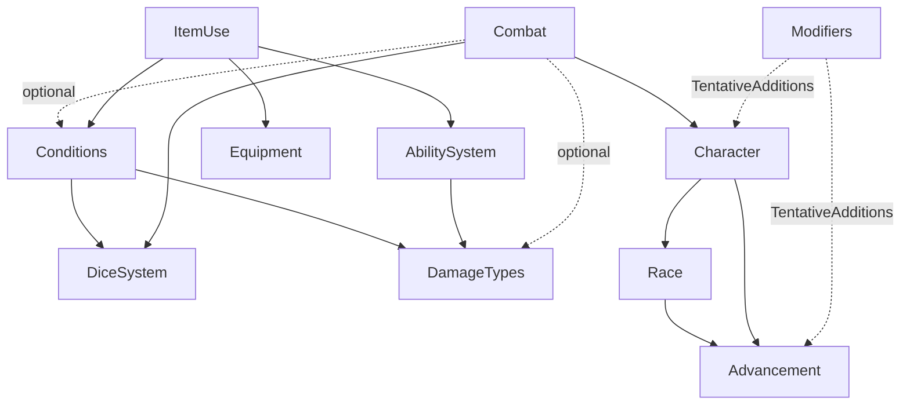

# Architecture — Module Map (Part 1)

This is the static structure of the Crimson Steel codebase: which
modules exist, what each one owns, and how they depend on each other.
Cross-domain workflows (how data flows through these modules during
an attack, a spell cast, an equip event, etc.) and the aggregated
list of unassigned responsibilities live in `architecture-part-2.md`
(forthcoming).

The diagrams and the indented bullet-list below describe the same
graph in two notations. Pick whichever is easier to read; they're
kept in sync.

## Module roster

| Module | Folder | Lib | Spec | Status |
|---|---|---|---|---|
| Dice resolution | `docs/dice_resolution/` | `lib/dice_system.rb` | ✅ | complete |
| Damage types | `docs/damage_types/` | `lib/damage_types.rb` | ✅ | complete |
| Conditions | `docs/conditions/` | `lib/conditions.rb` | ✅ | complete |
| Abilities | `docs/abilities/` | `lib/abilities.rb` | ✅ | complete |
| Equipment | `docs/equipment/` | `lib/equipment.rb` | ✅ | MVP — loot tables, shops, magical-item gen, Restock, Loot Archive deferred |
| Race | `docs/race/` | `lib/race.rb` | ✅ | complete |
| Advancement | `docs/advancement/` | `lib/advancement.rb` | ✅ | complete |
| Character | `docs/character/` | `lib/character.rb` | ✅ | thin coordinator (delegates to Race + Advancement) |
| Skills | `docs/skills/` | (config only) | — | catalog data; no class |
| Combat | `docs/combat/` | `lib/combat.rb` | ✅ | tracker + Severity Calculation pipeline; full attack-resolution composition pending |
| Item use | (in `equipment_design.md`) | `lib/item_use.rb` | ✅ | orchestration for potions, oils, scrolls; wand mana deferred |
| Modifiers | — | (`lib/modifiers.rb` on TentativeAdditions) | — | reads ability `modifiers:` lists and folds always-on bonuses through Character |

The five modules without a backing class today (Skills) or living
only on TentativeAdditions (Modifiers) are noted so the dependency
graph stays honest.

## Dependency graph

`A → B` means *A loads or calls into B at runtime*. It does **not**
include "A's docs reference B's terms" — that's almost every pairing
and isn't structural.



### Same graph as an indented bullet list

```
DiceSystem                  (no deps)
DamageTypes                 (no deps)
Equipment                   (no deps; equip-time wiring to Conditions
                             happens via callbacks supplied by the caller)
Skills                      (config only; consumed by Advancement)

Advancement
└── (consumes Skills config)

Race
└── Advancement              (shares the Ability struct + sticky-min_level helper)

Character
├── Race
└── Advancement

Conditions
├── DiceSystem               (for affliction save Rolls)
└── DamageTypes              (consumes the Severities list at construction)

AbilitySystem
└── DamageTypes              (validates `damage_type:` entries against the catalog)

Combat
├── DiceSystem               (initiative rolls, action-dice math)
├── Character (via lookup)   (attribute reads for derived values)
├── DamageTypes (optional)   (Severity Calculation)
└── Conditions (via lookup)  (damage routing target)

ItemUse
├── Equipment                (inventory state and quantity decrement)
├── AbilitySystem            (resolve the contained spell at the item's tier)
└── Conditions (via lookup)  (heal cascade, ward, magic toxicity)

Modifiers   (lives on TentativeAdditions only)
├── Advancement              (reads ability `modifiers:` lists)
└── Character                (folds always-on bonuses into attribute reads)
```

A few things worth pointing out about the graph:

- **No cycles.** Every dependency points "up" toward more general
  modules. Character depends on Race and Advancement; Race depends on
  Advancement (for shared structs); Advancement depends on nothing.
  Combat and ItemUse sit at the orchestration tier and pull in
  whatever they need.
- **Most cross-domain wiring is callback-shaped.** Combat takes a
  `character_lookup` and a `conditions_lookup`; ItemUse takes a
  `conditions_lookup`; Equipment expects callers to do the
  `REMOVE_EFFECTS_BY_PREFIX` calls themselves. This keeps the
  individual libraries cycle-free and lets a future orchestration
  layer (or a fresh-cloned test) substitute lighter doubles.
- **Skills is config-only.** There's no Skills class; the catalog is
  consumed by Advancement directly. Same shape as the (forthcoming)
  Procedural Abilities catalog will likely take.

## What each module owns

One paragraph per module describing the slice of state and behavior
that's *its* responsibility. The detailed lists live in each module's
`*_design.md`'s "Owned by the X domain" section; this is the brief.

**DiceSystem** owns die rolling, Target Number computation with
overflow conversion, the per-Roll modifiers (Reroll Operation, Sweep
Reroll, Value Adjustment with their fixed application order), and
Check composition across multiple Rolls (Degree of Success
aggregation, Fumble detection). Configurable: Die Size, Base/Min/Max
Target Number, Bonus Types List, Default Success/Fumble Thresholds.

**DamageTypes** owns the catalog of damage types — name, severity (or
runtime-bucketing flag), description, and structured mechanics. Pure
reference; no application. Validates that each entry has a recognized
shape and that mechanic kinds carry the required fields.

**Conditions** owns per-creature mutable state that isn't part of the
creature's base definition: HP damage counters, ability damage
(FIFO-ordered per attribute), Temporary HP grant, magic toxicity,
shock with overflow, the Acid Counter, the ordered Affliction list,
and the unified Effects list. Implements the heal cascade, the
Affliction Resolution pipeline (Severity Save Penalty injection, Tier
substitution, Severity evolution), Effect storage with source-id
replacement, lookup-time bonus/penalty stacking, the `APPLY_NAMED_EFFECT`
catalog dispatch, and `REMOVE_EFFECTS_BY_PREFIX` for namespaced cleanup.

**AbilitySystem** owns the spell/ability compendium and the
Procedural Abilities catalog. Reference-only: validates entries on
load, resolves Variants along whichever axis is in use (tier or
aspects), classifies Effects (none / named / damage with severity
parsing), evaluates damage formulas in a deferred-context shape so
the consumer supplies `success`/`critical`/`attribute` later. Also
exposes `GET_PROCEDURAL_TRIGGERS` for class/racial procedural
abilities and the always-on `modifiers:` read.

**Equipment** owns per-Owner inventories and item identity. Stack
identity matching, merge, cleanup, the four Owner kinds, item
add/remove/adjust/transfer, the per-category Unit Price formulas
(Weapon, Armor, Ammunition, Consumable, Guidance, Currency, Gem),
Total Wealth, Debit Wealth (cheapest-first coins → gems with
overpayment refund), and the three detail-fetchers. Equip-time
wiring to Conditions uses the `equipment:*` Source ID Namespace.
Loot tables, shop refresh, magical-item generation, atomic Restock,
and the Loot Archive are documented but not yet implemented in the
library — see `docs/TODO.md`.

**Race** owns the race catalog and Race Chain walking. Returns a
race's name, size, speed, accumulated `ability_score_adjustments`,
and `abilities` filtered by the Character's total class level. First-
in-chain semantics for scalar fields, accumulate-across-chain for
adjustments, concatenate-with-dedup for abilities.

**Advancement** owns everything that scales with tier and class
levels: Tier auto-computation from class levels and tag-keyed
breakpoint lists, Flat + Focused attribute bonuses, Class Chain
ability granting (with Scaling Ability level accumulation across
ancestors), skill-rank computation per Class with class/average/
opposed rates and prefix matching, save-rank computation, HP and
mana formulas. Reads `advancement_config.yaml` and `skills.yaml`.

**Character** is a thin coordinator. Owns identity (id, name, player,
tags), base attributes, the Tier Override, and the Ritual List.
Holds one Race instance and one Advancement instance per Character;
delegates every derived read to those (effective attributes, Tier,
abilities merge with first-seen-wins dedup, max HP, max mana,
damage_resilience tier-base + class contribution, damage_reduction).

**Skills** is configuration data, not a class. Defines each skill's
attribute, description, optional `set: true` flag (Skill Sets are
open prefix namespaces), and `mandatory: true` flag (mandatory
Skills are auto-contributed by every class). Plus the unenforced
`minimum_skills_trained` directive.

**Combat** owns the round-by-round combat tracker (combatants,
two-ID scheme, turn order with die-by-die tie-break, initiative
dice with combat-specific Luck/Insight rules, action dice spend),
plus the Severity Calculation half of attack resolution
(`apply_attack_damage`: damage type lookup → pre-bucketing
mechanics → severity decision → routing to Conditions → post-
damage side-effects). The dice-rolling half of the attack
pipeline is documented and may be implemented anywhere (today,
client-side); only the damage routing is in the lib.

**ItemUse** is orchestration for consuming an item. Looks up the
contained spell through abilities, reads conventional Effect Hash
keys to detect cure / mana / ward effects, applies them to the
target's Conditions, computes per-form Magic Toxicity (potion
overhead formula, scroll improved_healing discount), enforces the
saturation gate, and decrements item quantity. No state of its
own — the participants own all the storage.

**Modifiers** (TentativeAdditions only) reads each ability's
optional `modifiers:` list from `advancement_config.yaml` and
`race_config.yaml` and folds the always-on bonuses through
Character's attribute / save / skill / max-HP / max-mana reads.
Today's source of truth for "fast_movement gives +10 speed" type
bonuses.

## Configuration files

Each module reads its config from `data/`. The `data/*` directory is
gitignored at the project level, but the canonical fixtures (which
the spec suite loads at runtime) are force-added. The example
versions in `docs/<module>/<module>_*.yaml.example` are the schema
documentation.

| Config | Loaded by | Tracked? |
|---|---|---|
| `data/dice_resolution.yaml` | DiceSystem | force-added |
| `data/damage_types.yaml` | DamageTypes | force-added |
| `data/conditions.yaml` | Conditions | force-added |
| `data/abilities_config.yaml` | AbilitySystem | force-added |
| `data/abilities_data.yaml` | AbilitySystem | force-added |
| `data/equipment_config.yaml` | Equipment | force-added |
| `data/skills.yaml` | Advancement (skill metadata) | not yet seeded |
| `data/advancement.yaml` | Advancement (rules + classes) | not yet seeded |
| `data/races.yaml` | Race | not yet seeded |
| `data/characters.yaml` | Character (roster) | not yet seeded |
| `data/combat.yaml` | Combat (state file) | not yet seeded |
| `data/combat_rules.yaml` | Combat (tunables) | not yet seeded |

The "not yet seeded" rows are domains whose docs and example configs
exist but whose runtime fixtures haven't been promoted from the docs
into `data/` and force-added. Adding them is a small follow-up to
make the corresponding lib classes loadable end-to-end without
copying files manually.

## What's not in this part

This file deliberately covers **only structure**: who exists, what
they own, who depends on whom. Three things are intentionally out of
scope here and will be in `architecture-part-2.md`:

1. **Cross-domain workflows.** How an attack actually flows from
   "Combatant A attacks Combatant B" through DiceSystem → Combat →
   Conditions. How a spell cast composes Abilities + Conditions +
   Combat. How equipping a Belt of Strength composes Equipment +
   Conditions through the source-id namespace. These are operations
   that span multiple modules and need their own walkthroughs.
2. **Aggregated unassigned responsibilities.** Each module's
   `*_design.md` has its own "Unassigned" section; Part 2 will pull
   them into a single prioritized list so it's clear what's blocking
   what.
3. **Open architectural questions.** Where mana lives. Where per-day
   usage trackers live. Whether the Skills "module" eventually grows
   a class. The orchestration tier above ItemUse / Combat that
   composes them into HTTP-route-shaped operations.
