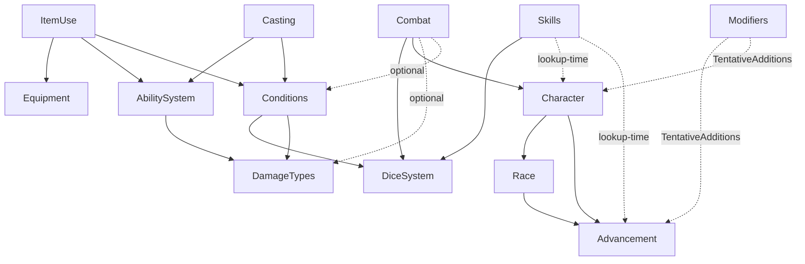

# Architecture

The structure of the Crimson Steel codebase: which modules exist,
what each one owns, how they depend on each other, how data flows
through them during typical operations, what's still unowned, and
the architectural questions still open.

The first half of the file (module roster, dependency graph,
ownership summaries) is **static structure**. The second half
(workflows, aggregated unassigned items, open questions) is
**dynamic** — what calls what, what's missing, what hasn't been
decided.

The diagrams and the indented bullet-list below describe the same
graph in two notations. Pick whichever is easier to read; they're
kept in sync.

## Module roster

| Module | Folder | Lib | Spec | Status |
|---|---|---|---|---|
| Dice resolution | `docs/dice_resolution/` | `lib/dice_system.rb` | ✅ | complete |
| Damage types | `docs/damage_types/` | `lib/damage_types.rb` | ✅ | complete |
| Conditions | `docs/conditions/` | `lib/conditions.rb` | ✅ | complete |
| Abilities | `docs/abilities/` | `lib/abilities.rb` | ✅ | complete |
| Equipment | `docs/equipment/` | `lib/equipment.rb` | ✅ | MVP — loot tables, shops, magical-item gen, Restock, Loot Archive deferred |
| Race | `docs/race/` | `lib/race.rb` | ✅ | complete |
| Advancement | `docs/advancement/` | `lib/advancement.rb` | ✅ | complete |
| Character | `docs/character/` | `lib/character.rb` | ✅ | thin coordinator (delegates to Race + Advancement) |
| Skills | `docs/skills/` | `lib/skills.rb` | ✅ | catalog + coordinator (Skill Prowess math, Versatile Performance routing) |
| Combat | `docs/combat/` | `lib/combat.rb` | ✅ | tracker + Severity Calculation pipeline; full attack-resolution composition pending |
| Item use | (in `equipment_design.md`) | `lib/item_use.rb` | ✅ | orchestration for potions, oils, scrolls; wand mana deferred |
| Casting | (Workflow D below) | `lib/casting.rb` | ✅ | direct spell-cast orchestration; mana cost from default-per-tier table or caller override |
| Modifiers | — | (`lib/modifiers.rb` on TentativeAdditions) | — | reads ability `modifiers:` lists and folds always-on bonuses through Character |

Modifiers still lives only on TentativeAdditions (no backing class
in this repo) and is noted so the dependency graph stays honest.

## Dependency graph

`A → B` means *A loads or calls into B at runtime*. It does **not**
include "A's docs reference B's terms" — that's almost every pairing
and isn't structural.



### Same graph as an indented bullet list

```
DiceSystem                  (no deps)
DamageTypes                 (no deps)
Equipment                   (no deps; equip-time wiring to Conditions
                             happens via callbacks supplied by the caller)

Skills
├── DiceSystem               (compute_check_details for the
│                             dice/bonus/starting partition)
├── Character (at lookup)    (Effective Attribute reads)
└── Advancement (at lookup)  (Skill Ranks, ability sub-choices)

Advancement
└── (consumes Skills catalog data)

Race
└── Advancement              (shares the Ability struct + sticky-min_level helper)

Character
├── Race
└── Advancement

Conditions
├── DiceSystem               (for affliction save Rolls)
└── DamageTypes              (consumes the Severities list at construction)

AbilitySystem
└── DamageTypes              (validates `damage_type:` entries against the catalog)

Combat
├── DiceSystem               (initiative rolls, Combat Pool math)
├── Character (via lookup)   (attribute reads for derived values)
├── DamageTypes (optional)   (Severity Calculation)
└── Conditions (via lookup)  (damage routing target)

ItemUse
├── Equipment                (inventory state and quantity decrement)
├── AbilitySystem            (resolve the contained spell at the item's tier)
└── Conditions (via lookup)  (heal cascade, ward, magic toxicity)

Casting
├── AbilitySystem            (resolve the spell at the caster's rank)
└── Conditions (via lookup)  (caster mana spend + caster toxicity;
                              target heal cascade, ward, mana)

Modifiers   (lives on TentativeAdditions only)
├── Advancement              (reads ability `modifiers:` lists)
└── Character                (folds always-on bonuses into attribute reads)
```

A few things worth pointing out about the graph:

- **No cycles.** Every dependency points "up" toward more general
  modules. Character depends on Race and Advancement; Race depends on
  Advancement (for shared structs); Advancement depends on nothing.
  Combat and ItemUse sit at the orchestration tier and pull in
  whatever they need.
- **Most cross-domain wiring is callback-shaped.** Combat takes a
  `character_lookup` and a `conditions_lookup`; ItemUse takes a
  `conditions_lookup`; Equipment expects callers to do the
  `REMOVE_EFFECTS_BY_PREFIX` calls themselves. This keeps the
  individual libraries cycle-free and lets a future orchestration
  layer (or a fresh-cloned test) substitute lighter doubles.
- **Skills is a thin coordinator.** The Skill catalog is data;
  the `Skills` class adds three jobs: resolving a Skill (with Set-prefix
  fallback), computing Skill Prowess (`Ranks + floor(Attribute / divisor)`),
  and routing Versatile Performance lookups. Per-Character Skill Ranks
  still live on Advancement; Skills asks for them at lookup time.

## What each module owns

One paragraph per module describing the slice of state and behavior
that's *its* responsibility. The detailed lists live in each module's
`*_design.md`'s "Owned by the X domain" section; this is the brief.

**DiceSystem** owns die rolling, Target Number computation with
overflow conversion, the per-Roll modifiers (Reroll Operation, Sweep
Reroll, Value Adjustment with their fixed application order), and
Check composition across multiple Rolls (Degree of Success
aggregation, Fumble detection). Configurable: Die Size, Base/Min/Max
Target Number, Bonus Types List, Default Success/Fumble Thresholds.

**DamageTypes** owns the catalog of damage types — name, severity (or
runtime-bucketing flag), description, and structured mechanics. Pure
reference; no application. Validates that each entry has a recognized
shape and that mechanic kinds carry the required fields.

**Conditions** owns per-creature mutable state that isn't part of the
creature's base definition: HP damage counters, ability damage
(FIFO-ordered per attribute), Temporary HP grant, magic toxicity,
shock with overflow, the Acid Counter, the ordered Affliction list,
and the unified Effects list. Implements the heal cascade, the
Affliction Resolution pipeline (Severity Save Penalty injection, Tier
substitution, Severity evolution), Effect storage with source-id
replacement, lookup-time bonus/penalty stacking, the `APPLY_NAMED_EFFECT`
catalog dispatch, and `REMOVE_EFFECTS_BY_PREFIX` for namespaced cleanup.

**AbilitySystem** owns the spell/ability compendium and the
Procedural Abilities catalog. Reference-only: validates entries on
load, resolves Variants along whichever axis is in use (tier or
aspects), classifies Effects (none / named / damage with severity
parsing), evaluates damage formulas in a deferred-context shape so
the consumer supplies `success`/`critical`/`attribute` later. Also
exposes `GET_PROCEDURAL_TRIGGERS` for class/racial procedural
abilities and the always-on `modifiers:` read.

**Equipment** owns per-Owner inventories and item identity. Stack
identity matching, merge, cleanup, the four Owner kinds, item
add/remove/adjust/transfer, the per-category Unit Price formulas
(Weapon, Armor, Ammunition, Consumable, Guidance, Currency, Gem),
Total Wealth, Debit Wealth (cheapest-first coins → gems with
overpayment refund), and the three detail-fetchers. Equip-time
wiring to Conditions uses the `equipment:*` Source ID Namespace.
Loot tables, shop refresh, magical-item generation, atomic Restock,
and the Loot Archive are documented but not yet implemented in the
library — see `docs/TODO.md`.

**Race** owns the race catalog and Race Chain walking. Returns a
race's name, size, speed, accumulated `ability_score_adjustments`,
and `abilities` filtered by the Character's total class level. First-
in-chain semantics for scalar fields, accumulate-across-chain for
adjustments, concatenate-with-dedup for abilities.

**Advancement** owns everything that scales with tier and class
levels: Tier auto-computation from class levels and tag-keyed
breakpoint lists, Flat + Focused attribute bonuses, Class Chain
ability granting (with Scaling Ability level accumulation across
ancestors), skill-rank computation per Class with class/average/
opposed rates and prefix matching, save-rank computation, HP and
mana formulas. Reads `advancement_config.yaml` and `skills.yaml`.

**Character** is a thin coordinator. Owns identity (id, name, player,
tags), base attributes, the Tier Override, and the Ritual List.
Holds one Race instance and one Advancement instance per Character;
delegates every derived read to those (effective attributes, Tier,
abilities merge with first-seen-wins dedup, max HP, max mana,
damage_resilience tier-base + class contribution, damage_reduction).

**Skills** owns the Skill catalog (each Skill's attribute,
description, optional `set: true` flag for open-prefix Skill Sets,
and `mandatory: true` flag for the Skills every Class auto-trains)
plus a thin coordinator class. The class exposes one read,
`skill_details(skill_name, character, advancement)`, which composes
`Skill Prowess = Ranks + floor(Attribute / divisor)` and partitions
it via `DiceSystem#compute_check_details` into a Dice Count, a
Competency Bonus, and a Starting Value. Versatile Performance is
routed at lookup time: when the requested Skill is one the
Character's chosen Performances cover, the highest-Prowess
candidate wins and its triple replaces the requested Skill's
(but the requested name is preserved on the way out). Plus the
unenforced `minimum_skills_trained` directive.

**Combat** owns the round-by-round combat tracker (combatants,
two-ID scheme, turn order via Initiative String lex compare,
initiative rolls with combat-specific Luck/Insight rules, Combat
Pool spend),
plus the Severity Calculation half of attack resolution
(`apply_attack_damage`: damage type lookup → pre-bucketing
mechanics → severity decision → routing to Conditions → post-
damage side-effects). The dice-rolling half of the attack
pipeline is documented and may be implemented anywhere (today,
client-side); only the damage routing is in the lib.

**ItemUse** is orchestration for consuming an item. Looks up the
contained spell through abilities, reads conventional Effect Hash
keys to detect cure / mana / ward effects, applies them to the
target's Conditions, computes per-form Magic Toxicity (potion
overhead formula, scroll improved_healing discount), enforces the
saturation gate, and decrements item quantity. No state of its
own — the participants own all the storage.

**Modifiers** (TentativeAdditions only) reads each ability's
optional `modifiers:` list from `advancement_config.yaml` and
`race_config.yaml` and folds the always-on bonuses through
Character's attribute / save / skill / max-HP / max-mana reads.
Today's source of truth for "fast_movement gives +10 speed" type
bonuses.

## Configuration files

Each module reads its config from `data/`. The `data/*` directory is
gitignored at the project level, but the canonical fixtures (which
the spec suite loads at runtime) are force-added. The example
versions in `docs/<module>/<module>_*.yaml.example` are the schema
documentation.

| Config | Loaded by | Tracked? |
|---|---|---|
| `data/dice_resolution.yaml` | DiceSystem | force-added |
| `data/damage_types.yaml` | DamageTypes | force-added |
| `data/conditions.yaml` | Conditions | force-added |
| `data/abilities_config.yaml` | AbilitySystem | force-added |
| `data/abilities_data.yaml` | AbilitySystem | force-added |
| `data/equipment_config.yaml` | Equipment | force-added |
| `data/skills.yaml` | Skills + Advancement (skill metadata) | force-added |
| `data/advancement.yaml` | Advancement (rules + classes) | not yet seeded |
| `data/races.yaml` | Race | not yet seeded |
| `data/characters.yaml` | Character (roster) | not yet seeded |
| `data/combat.yaml` | Combat (state file) | not yet seeded |
| `data/combat_rules.yaml` | Combat (tunables) | not yet seeded |

The "not yet seeded" rows are domains whose docs and example configs
exist but whose runtime fixtures haven't been promoted from the docs
into `data/` and force-added. Adding them is a small follow-up to
make the corresponding lib classes loadable end-to-end without
copying files manually.


## Cross-domain workflows

The walkthroughs below describe the logic of each operation
end-to-end, in the same language-agnostic style the rest of the
docs use. Some halves are implemented in Ruby today, some in
JavaScript, and some are not yet implemented; the workflow itself
is the spec, regardless of where the code lands.

### Workflow A — Attack

The full attack pipeline runs in two halves. The first half decides
*what damage lands*; the second half routes it through modules.

1. **Build the attacker's Roll.** Combat asks the attacker's
   Character for the attribute / skill modifiers, asks Conditions
   (via `GET_MODIFIERS`) for active buffs and debuffs on the
   relevant `target_key`, and assembles a modifier dict for
   dice resolution. The action's dice count comes from
   `Combat#combat_pool` minus the attacker's spend.
2. **Build the defender's Opposed Roll** the same way, against the
   defender's defense action.
3. **Roll both Rolls** through `DiceSystem.RAND_ROLL_DICE` /
   `COMPUTE_ROLL_PARAMETERS` / `COMPUTE_RESULTS`. The damage type's
   `critical_value` mechanic, if any, supplies `critical_modifier`
   to the attacker's Roll — `Combat#critical_modifier_for(damage_type)`
   answers that lookup.
4. **Compute the Degree of Success** for the Check (attacker DoIS
   minus defender DoIS). A DoS ≥ Default Success Threshold means the
   attack lands.
5. **Compute raw damage.** Either:
   - the spell's declared damage Effect is evaluated through
     `AbilitySystem#evaluate_damage` with the attacker's success and
     critical counts, or
   - if the attack carries no declared damage Effect (weapon attacks,
     elemental darts), Combat infers `Tier + Degree of Success +
     attack bonus`.
6. **Route damage** via `Combat#apply_attack_damage`:
   - Look up the damage type in DamageTypes.
   - Apply pre-bucketing mechanics: `damage_per_dice` and
     `damage_multiplier` (the latter consults the
     `condition_evaluator` callback for tags like
     `target_has_metal_armor`).
   - Severity decision: declared severity for non-physical;
     runtime bucketing for physical, where the bucket size is
     `Threshold + target's Damage Resilience`. Threshold comes from
     the weapon (Equipment) or ability (Abilities) input; Damage
     Resilience is read through the `character_lookup` callback.
   - Call `Conditions#apply_hit_point_damage` on the target.
   - Apply post-damage side-effects: `apply_acid_counter` →
     `Conditions#apply_acid_damage`, `inflict` with
     `condition_name=shock` → `Conditions#apply_shock`. Other
     `condition_name` values come back tagged `unrouted` until the
     conditions module exposes the right API.

What's missing today: a single end-to-end entry point that wires
both halves into one call. Steps 1–5 are done by the caller; step 6
is `apply_attack_damage`. A future `Combat#perform_attack(attacker,
target, weapon)` would compose them.

### Workflow B — Item consumption

Already implemented in `lib/item_use.rb`.

1. Caller invokes `ItemUse#consume(owner_id, stack_index, item_form,
   spell_name, target_char_id, ...)`.
2. ItemUse reads the stack from Equipment, picks the spell's
   tier_index from the item's tier, and calls
   `AbilitySystem#resolve_entry`.
3. ItemUse inspects the resolved Effect Hash for the conventional
   keys: `minor_damage` / `moderate_damage` / `major_damage`
   (cure pools), `mana` (mana restore), `temp_hp` (ward).
4. **Saturation gate**: if the target's `Conditions#magic_toxicity`
   is at or above the supplied `target_max_toxicity`, cure and mana
   refuse to land. Ward bypasses the gate.
5. Cure pools route through `Conditions#apply_hit_point_heal_cascade`.
   Ward routes through `Conditions#set_temporary_hit_points` with a
   source id of `item:<owner>:<spell>`. Mana surfaces back as
   `unrouted: true` because mana storage isn't yet defined.
6. Compute Magic Toxicity:
   - **Potion / Oil**: `max(saturation - target_tier,
     minimum_saturation) + floor(2 * tier_value(item_tier) *
     2^max(item_tier - user_tier, 0))`.
   - **Scroll**: `max(saturation - target_tier - improved_healing
     reduction, minimum_saturation)`. The user's `improved_healing`
     ability shaves `2 * user_tier` off cure scrolls.
   - **Wand**: 0 (deferred).
7. `Conditions#apply_magic_toxicity` on the target.
8. **Decrement** the item's quantity by one for consumable forms via
   `Equipment#adjust_stack_quantity` and `cleanup_zero_quantity`.
   Wands and persistent magic items keep their quantity.

If the saturation gate fired, ItemUse returns `saturation_blocked:
true` with no applications and no quantity decrement, leaving the
caller to surface the failure cleanly.

### Workflow C — Equipping an item

Logic exists in the design docs; no orchestration class today.
Callers do the steps directly.

1. **Equip**: caller marks the stack as equipped. Stack identity
   includes `equipped`, so a freshly-equipped item is
   *not* the same Stack as an unequipped copy of the same type —
   they don't merge.
2. **Post effects**: for each effect the item should grant
   (Belt of Strength: `+2 str` Inherent bonus), the caller picks a
   deterministic `source_id` in the `equipment:<owner>:<stack_key>`
   namespace and calls `Conditions#apply_effect`. Apply-by-source-id
   is idempotent — re-applying the same id overwrites the slot.
3. **Unequip**: caller calls
   `Conditions#remove_effects_by_prefix("equipment:<owner>:<stack_key>")`
   to strip every effect the stack contributed.
4. **Loadout reset**: caller calls
   `Conditions#remove_effects_by_prefix("equipment:<owner>:")`
   to nuke the entire equipment-driven effect list, then re-applies
   the current loadout fresh. This restores correctness coarsely
   without the caller tracking which stack maps to which Effect.

The "verify-or-recreate" guarantee is implicit. Equipment never asks
Conditions whether an effect is present; it just re-applies on every
relevant change.

### Workflow D — Spell cast (direct, not via item)

Implemented in `lib/casting.rb` as a parallel-shaped orchestration to `ItemUse`.

1. Caller invokes `Casting#cast(spell_name:, caster_char_id:, target_char_id:, rank:, mana_cost:, ...)`.
2. **Mana check.** If the caster's `current_mana` is below `mana_cost`, return `error: 'insufficient_mana'` immediately — no effects, no mana spent.
3. Resolve the spell entry through `AbilitySystem#resolve_entry` at the caller-supplied rank (and tier_index / aspect_index for Variant axes).
4. **Saturation gate** (caster-side, mirroring ItemUse's target-side gate). When the caller supplies `caster_max_toxicity:` and the caster's `magic_toxicity` is at or above that cap, cure and mana effects refuse to land — return `saturation_blocked: true` with no mana spent and no applications. Ward effects bypass the gate.
5. **Spend mana** from the caster via `Conditions#apply_mana_cost`.
6. **Apply effects to the target** by reading the resolved Effect Hash for conventional keys: `minor_damage`/`moderate_damage`/`major_damage` → cure cascade, `mana` → mana restore (capped at caller-supplied `target_max_mana:`), `temp_hp` → ward grant with source id `spell:<caster>:<spell>`.
7. **Magic toxicity on the caster** (not the target — that's the item flow). Formula: `max(saturation, minimum_saturation)` from the resolved Effect Hash. No "potion overhead" term.
8. **Return deferred work** — the spell's `effects` list (damage objects with deferred `success`/`critical` evaluation) and `saves` list come back intact for caller-driven save resolution and damage routing through `Combat#apply_attack_damage`. The Concentration Block is returned for the caller to track concentration on the caster.

Mana cost defaults from the abilities catalog's `Default Mana Cost Per Tier` table (`{0: 1, 1: 4, 2: 6, 3: 8, 4: 10, 5: 12}` by default). The caller can still override via `mana_cost:`. Spells whose description notes an extra cost (Recharge, etc.) are the human DM's responsibility to add on top — the schema doesn't yet carry per-spell overrides as a structured field.

### Workflow D' — Ritual cast

`Casting#cast_ritual` is a thin extension of `cast` for rituals. Same pipeline; two adjustments:

- **Material gold cost.** `AbilitySystem#ritual_gold_cost(spell, tier)` reads `Ritual Cost.gold_per_tier`. The cost is debited from the supplied `gold_owner_id` via `Equipment#debit_wealth`. When the owner can't pay, returns `error: 'insufficient_gold'` with no mana spent and no effects.
- **Total casting time.** `AbilitySystem#ritual_casting_time_rounds(spell, tier)` returns `max(spell.casting_time_rounds, 1) + Ritual Cost.casting_time_per_tier[tier]`. The result is included in the `cast_ritual` return for the caller to advance the calendar accordingly.

If `cast()` bails on insufficient mana or the saturation gate, `cast_ritual` returns the same bail-out unchanged — gold is **not** debited because the ritual didn't happen. The Equipment dependency is supplied at construction; ritual casts raise without it.

### Workflow E — Affliction tick

Already implemented.

1. Caller invokes `Conditions#resolve_affliction(name, save_input,
   creature_tier, current_round)`.
2. Conditions injects a Severity Save Penalty equal to
   `floor(severity / divisor)` into the supplied `Competency Penalty`.
3. Calls `DiceSystem` to roll the save.
4. Computes magnitude (`1 + floor(severity / divisor)`) and
   net_magnitude (`max(0, magnitude - successes)`).
5. Applies the Affliction's effect (`hit_point_damage`,
   `ability_damage`, or `named_effect`) at net_magnitude.
6. Evolves severity: `delta = -floor(decay) -
   floor(successes * per_success) + floor(failures * per_failure)`.
7. Removes the Affliction if severity reached zero.

## Aggregated unassigned responsibilities

The per-domain Unassigned bullets, grouped by theme.

### Cluster 1 — Catalog content (HIGH PRIORITY)

The schemas and homes are defined; the actual catalog content
isn't yet populated.

- **Procedural Abilities catalog**: most class/racial stateless
  abilities (`sneak_attack`, `channel_divinity`, `improved_healing`,
  `sense_injury`, `trapfinding`'s concentration variant, etc.) have
  no entries yet. Schema: `name → triggers: [{on, condition,
  effect}]`.
- **Effect Names catalog**: stateful class/racial abilities (`rage`,
  `bardic_inspiration`, etc.) need entries with structured
  Mechanics. The catalog has the basic conditions (`blind`,
  `dazzled`, `paralyzed`, `prone`, `flustered`) but not the class-
  ability content.
- **Always-On Modifier entries** on each ability's `modifiers:`
  field in `advancement_config.yaml` and `race_config.yaml`.
  TentativeAdditions has the schema and a few examples; most
  entries are still empty.

### Cluster 2 — Cross-domain wiring

Modules exist; the bridges between them aren't pinned to a class.

- **Acid Counter wiring**: `Conditions#apply_acid_damage` exists,
  but it's `Combat#apply_attack_damage` that decides when to call
  it (via the `apply_acid_counter` mechanic). Today's wiring lives
  inline inside `apply_attack_damage`; that's fine but worth
  re-examining if more counter types arrive.
- **End-to-end attack-resolution composition**: the to-hit roll +
  damage routing pieces both exist; a single
  `Combat#perform_attack(attacker, target, weapon)` doesn't.
- **Casting orchestration** (Workflow D above) — no class today.

### Cluster 3 — Missing infrastructure

Whole concepts that aren't represented anywhere.

- **Mana tracking**. Character exposes `max_mana` (formula); nothing
  tracks current mana. ItemUse surfaces mana applications as
  `unrouted: true`. Decision needed (see open questions).
- **Per-day usage trackers** (Channel Divinity uses-per-day). No
  home decided.
- **Encumbrance**. Currency carries a `weight` field; armor and
  weapons don't. No system computes total weight.
- ~~**Skill-Roll API**~~ — resolved by the new Skills class +
  `DiceSystem#compute_check_details`.
- **Equipment deferred items**: loot tables (4 row shapes + Roll
  Variables), magical-item generation, specific/generic shop
  refresh, Game Day counter, atomic Restock, Loot Archive. All
  documented in `equipment_design.md`; none implemented.

### Cluster 4 — Validation gaps (the silent-typo cluster)

A single startup-time linter could knock out the whole list.

- Roster `race:` / class keys → real race / class.
- `parent_class`, `parent_race` → real chain target.
- Skill list entries (`class_skills`, `non_class_skills`,
  `opposed_skills`) → real skills.
- `tier_attribute_advancement` picks → real attribute keys.
- `attribute:` in `skills_config.yaml` → one of six real attributes.
- `damage_type` references in compendium → catalog entry (already
  validated when AbilitySystem is constructed with DamageTypes).
- Loot table `item:` / property references → real catalog entries.
- Material names on Armor → defined Materials.
- Damage Types `condition` / `condition_name` strings → consumer-
  recognized concepts.
- Effect strings declared by abilities → real Effect Names (raised
  today only at apply-time).
- Procedural Abilities catalog references → real class/racial
  ability names (when the catalog has content).

### Cluster 5 — Untracked / unowned state

- **Per-Character narrative state** (DM notes, custom flags). Conditions
  owns mechanical state, nothing owns narrative.
- **Persistence of identity mutations** (renames, race changes).
  Characters are read-only at startup.
- **Bonus skills enforcement**. `bonus_skills` is a Class field
  documented but unenforced.
- **`minimum_skills_trained` enforcement**. Documented but
  unenforced.
- **Class contributions to `damage_resilience` / `damage_reduction`**.
  Methods return 0 placeholders; the actual scaling rules per
  class haven't been designed.

### Cluster 6 — Edge-case / housekeeping

- **Validating dice count is within Min/Max range**.
- **Validating `rank` is non-negative**.
- **Initiative reroll edge cases** with multiple Insight iterations.
- **The reserved `none` key in `properties_weighted`** for magical-
  item generation — silently shadowed if a Property is ever named
  `none`.
- **Properties registry** distinguishing display-only from
  mechanically-effective properties.
- **Preferred starting attribute distributions per Race** (point-buy
  steering).

## Open architectural questions

The decisions that haven't been made yet, with the trade-offs as I
understand them. Each one will eventually need an answer.

### Where does mana live? (decided)

**Mana lives on Conditions** as a `current_mana` field, parallel
to the HP damage counters and magic toxicity. HP and mana are
the same kind of thing — recoverable per-creature resource — and
they recover under the same per-day rules, so they live together.

Operations: `apply_mana_cost(amount)` (floor at zero, returns
amount actually spent), `restore_mana(amount, max:)` (clamp at
the supplied cap), `set_mana(amount, max:)`. The cap (`max_mana`)
is supplied by the caller from the Character; Conditions does
not look it up itself.

ItemUse's mana applications now route through
`Conditions#restore_mana` when the caller supplies
`target_max_mana:`. Without the cap, the result is still tagged
`unrouted: true` so the caller can apply it externally.

### Natural Recovery (decided)

The thing I had previously framed as "per-day usage trackers" is
really **Natural Recovery** — the rules that govern how HP, ability
damage, mana, magic toxicity, and temp HP change as time passes.

`Conditions#apply_natural_recovery(days:, mode:, character_tier:,
mana_max:, magic_toxicity_attribute_score:)` rolls all five rules
forward. The recovery rates live in `conditions_config.yaml` under
a `Natural Recovery` block:

- **Heal Rate**: a tier-indexed table of `[low, high, unit]`
  per severity. Low is the per-period heal in `mode: short_rest`;
  high is `mode: long_term_recovery`; unit is the period length
  in days (so a major-damage row with unit 7 only heals once per
  full week).
- **Ability Heal Rate**: same shape, governs ability-damage
  recovery with FIFO popping across attributes.
- **Mana Per Day Divisor** (default 4): mana per day =
  `floor(mana_max / divisor)`.
- **Magic Toxicity Per Day Divisor** (default 4): toxicity decay
  per day = `floor(toxicity_attribute_score / divisor)` where the
  toxicity attribute is typically `cha`.

Temporary HP clears on every recovery call regardless of its
`ends_on_round`. Time is the natural enemy of temp HP.

### What about Channel Divinity-style "uses per day"?

The user pushed back on framing this as a separate concern. For
now: deferred. When we get there, the natural pattern is the same
shape as mana — a counter on Conditions, refilled by
`apply_natural_recovery` (or by a future
`apply_per_encounter_recovery` for "uses per encounter"). The
catalog entry would declare the cap and the cadence.

### Skills grew a class (decided)

Skills used to be config-only; Advancement read it for the
`mandatory` flag and the per-skill attribute lookup, and every
caller assembled its own Check spec ad hoc.

`lib/skills.rb` is now a thin coordinator with three jobs:

- **Skill resolution** — looks up the skill catalog entry, with
  Set-prefix fallback so `perform_dance` / `craft_smith` resolve to
  their parent set's attribute and metadata.
- **Skill Prowess computation** — `Ranks + floor(Attribute /
  divisor)`. Ranks come from Advancement at lookup time; Attribute
  comes from Character; divisor comes from skills config.
- **Versatile Performance routing** — when looking up a `perform_*`
  skill, the highest-prowess perform variant the Character has
  trained wins, with the requested skill name preserved on the
  return so callers can attribute the roll correctly.

`DiceSystem#compute_check_details(prowess)` is the dice-resolution
side of the partition: returns `[Dice Count, Competency Bonus,
Starting Value]` from a Prowess integer. Skills hands the Prowess;
DiceSystem partitions it; the caller folds the result into a
modifier dictionary and rolls.

This kills the "Skill-Roll API" and "validate skill list entries"
items from the Unassigned cluster.

### What's the orchestration tier?

`ItemUse` is the first orchestration class. `Combat#apply_attack_damage`
is also orchestration (it sequences DamageTypes lookups, calls
Conditions APIs, etc.) but lives inside Combat itself.

When more workflows arrive — direct casting, full attack resolution,
turn-start ticks, downtime services — they need a home. Three
options:

- **(a) Keep adding orchestration to existing modules.** Combat
  grows `perform_attack`; Conditions grows turn-start hook
  invocation; etc. The orchestration is glued to the module that
  most naturally owns its main side-effects.
- **(b) Top-level orchestration classes** like `ItemUse` and the
  hypothetical `Casting`. Each workflow gets its own class that
  composes the modules it needs.
- **(c) A single `GameSession` god-class** that holds references to
  every module and exposes high-level operations.

(b) seems cleanest based on how `ItemUse` shaped up — small
focused classes with clear participants. (a) is fine for operations
deeply tied to one module's state. (c) leads to circular dependencies
fast.

### Implementation language allocation

Today's split puts the dice-rolling half of attack resolution in
JavaScript and the damage-routing half in Ruby. The docs describe
the logic regardless of where it runs. Open question: what's the
test strategy for client-side logic? Today the Ruby spec suite has
180+ examples; the JS half has none. As the to-hit math evolves,
this asymmetry will become more uncomfortable.

### Modifiers class boundary

`Modifiers` (TentativeAdditions only) reads each ability's `modifiers:`
list and folds them into Character reads. Today's reads use the
list directly. When the Procedural Abilities catalog grows, some
abilities will have *both* always-on Modifiers (folded by Modifiers)
and Trigger Specs (used by procedural lookups). Two questions:

- Does Modifiers eventually merge into AbilitySystem (since the
  data lives in ability entries)?
- Does it become a peer of Conditions, where "active modifiers"
  are looked up the same way active Effects are?

No answer yet. The boundary will get clearer as the procedural
catalog fills in.
