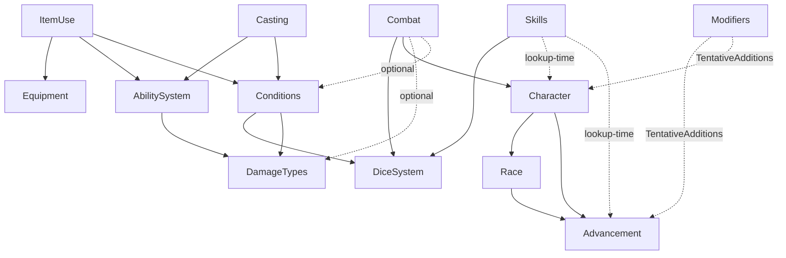

# Architecture

The structure of the Crimson Steel codebase: modules, ownership, dependencies, cross-domain workflows, unowned items, and open questions.

## Module roster

| Module | Folder | Lib | Spec | Status |
|---|---|---|---|---|
| Dice resolution | `docs/dice_resolution/` | `lib/dice_system.rb` | ✅ | complete |
| Damage types | `docs/damage_types/` | `lib/damage_types.rb` | ✅ | complete |
| Conditions | `docs/conditions/` | `lib/conditions.rb` | ✅ | complete |
| Abilities | `docs/abilities/` | `lib/abilities.rb` | ✅ | complete |
| Equipment | `docs/equipment/` | `lib/equipment.rb` | ✅ | MVP — loot tables, shops, magical-item gen, Restock, Loot Archive deferred |
| Race | `docs/race/` | `lib/race.rb` | ✅ | complete |
| Advancement | `docs/advancement/` | `lib/advancement.rb` | ✅ | complete |
| Character | `docs/character/` | `lib/character.rb` | ✅ | thin coordinator |
| Skills | `docs/skills/` | `lib/skills.rb` | ✅ | catalog + coordinator |
| Combat | `docs/combat/` | `lib/combat.rb` | ✅ | tracker + Severity Calculation; full attack composition pending |
| Item use | (in `equipment_design.md`) | `lib/item_use.rb` | ✅ | potions, oils, scrolls; wand mana deferred |
| Casting | (Workflow D below) | `lib/casting.rb` | ✅ | direct spell-cast orchestration |
| Modifiers | — | (`lib/modifiers.rb` on TentativeAdditions) | — | folds always-on bonuses through Character |

## Dependency graph

`A → B` means *A loads or calls into B at runtime*.



### Same graph as an indented bullet list

```
DiceSystem                  (no deps)
DamageTypes                 (no deps)
Equipment                   (no deps; equip-time wiring via callbacks)

Skills
├── DiceSystem               (compute_check_details)
├── Character (at lookup)    (Effective Attribute reads)
└── Advancement (at lookup)  (Skill Ranks, ability sub-choices)

Advancement
└── (consumes Skills catalog data)

Race
└── Advancement              (Ability struct + sticky-min_level helper)

Character
├── Race
└── Advancement

Conditions
├── DiceSystem               (affliction save Rolls)
└── DamageTypes              (Severities list at construction)

AbilitySystem
└── DamageTypes              (validates `damage_type:` entries)

Combat
├── DiceSystem               (initiative rolls, Combat Pool math)
├── Character (via lookup)   (attribute reads for derived values)
├── DamageTypes (optional)   (Severity Calculation)
└── Conditions (via lookup)  (damage routing target)

ItemUse
├── Equipment                (inventory state)
├── AbilitySystem            (resolve contained spell)
└── Conditions (via lookup)  (heal cascade, ward, magic toxicity)

Casting
├── AbilitySystem            (resolve spell at caster's rank)
└── Conditions (via lookup)  (caster mana + toxicity; target effects)

Modifiers   (TentativeAdditions only)
├── Advancement              (reads ability `modifiers:` lists)
└── Character                (folds always-on bonuses)
```

- **No cycles.** Dependencies always point "up" toward more general modules.
- **Most cross-domain wiring is callback-shaped.** Combat takes `character_lookup` and `conditions_lookup`; ItemUse takes `conditions_lookup`; Equipment expects callers to do `REMOVE_EFFECTS_BY_PREFIX` themselves. Keeps libraries cycle-free and testable.
- **Skills is a thin coordinator.** Resolves Skills (with Set-prefix fallback), computes Skill Prowess, routes Versatile Performance. Per-Character Ranks still live on Advancement.

## What each module owns

**DiceSystem** — die rolling, TN computation with overflow conversion, per-Roll modifiers (Reroll Operation, Sweep Reroll, Value Adjustment in fixed order), Check composition (DoS aggregation, Fumble detection). Configurable: Die Size, Base/Min/Max TN, Bonus Types List, Default Success/Fumble Thresholds.

**DamageTypes** — catalog of damage types (name, severity or runtime-bucketing flag, description, mechanics). Pure reference; no application.

**Conditions** — per-creature mutable state: HP damage counters, ability damage (FIFO per attribute), Temporary HP grant, magic toxicity, shock with overflow, Acid Counter, Affliction list, Effects list. Implements heal cascade, Affliction Resolution pipeline, Effect storage with source-id replacement, lookup-time stacking, `APPLY_NAMED_EFFECT` catalog dispatch, `REMOVE_EFFECTS_BY_PREFIX`.

**AbilitySystem** — spell/ability compendium and Procedural Abilities catalog. Reference-only: validates entries on load, resolves Variants (tier or aspects axis), classifies Effects, evaluates damage formulas in deferred form. Exposes `GET_PROCEDURAL_TRIGGERS` and the always-on `modifiers:` read.

**Equipment** — per-Owner inventories, Stack Identity, four Owner kinds, item add/remove/adjust/transfer, per-category Unit Price formulas, Total Wealth, Debit Wealth, three detail-fetchers. Equip-time wiring via `equipment:*` Source ID Namespace. Loot tables, shop refresh, magical-item generation, atomic Restock, Loot Archive documented but deferred — see `docs/TODO.md`.

**Race** — race catalog and Race Chain walking. Returns name, size, speed, accumulated `ability_score_adjustments`, abilities filtered by total class level. First-in-chain for scalars; accumulate for adjustments; concatenate-with-dedup for abilities.

**Advancement** — everything that scales with tier and class levels: Tier auto-computation, Flat + Focused attribute bonuses, Class Chain ability granting, skill-rank computation per Class with class/average/opposed rates, save-rank computation, HP and mana formulas. Reads `advancement_config.yaml` and `skills.yaml`.

**Character** — thin coordinator. Owns identity, base attributes, Tier Override, Ritual List. Holds one Race and one Advancement instance; delegates derived reads.

**Skills** — Skill catalog plus a coordinator class exposing `skill_details(skill_name, character, advancement)`. Composes `Skill Prowess = Ranks + floor(Attribute / divisor)` and partitions via `DiceSystem#compute_check_details`. Versatile Performance routed at lookup time. Plus the unenforced `minimum_skills_trained` directive.

**Combat** — round-by-round tracker (combatants, two-ID scheme, turn order via Initiative String lex compare, initiative rolls with Luck/Insight, Combat Pool spend), plus the Severity Calculation half of attack resolution (`apply_attack_damage`). The dice-rolling half is documented and may be implemented anywhere (today client-side); only damage routing is in the lib.

**ItemUse** — orchestration for consuming an item. Looks up the contained spell, reads conventional Effect Hash keys (cure / mana / ward), applies them to target's Conditions, computes per-form Magic Toxicity, enforces saturation gate, decrements quantity. No state of its own.

**Modifiers** (TentativeAdditions only) — reads each ability's `modifiers:` list and folds always-on bonuses through Character reads. Source of truth for "fast_movement gives +10 speed" type bonuses.

## Configuration files

Each module reads its config from `data/`. The directory is gitignored; canonical fixtures are force-added. The example versions in `docs/<module>/<module>_*.yaml.example` document the schema.

| Config | Loaded by | Tracked? |
|---|---|---|
| `data/dice_resolution.yaml` | DiceSystem | force-added |
| `data/damage_types.yaml` | DamageTypes | force-added |
| `data/conditions.yaml` | Conditions | force-added |
| `data/abilities_config.yaml` | AbilitySystem | force-added |
| `data/abilities_data.yaml` | AbilitySystem | force-added |
| `data/equipment_config.yaml` | Equipment | force-added |
| `data/skills.yaml` | Skills + Advancement | force-added |
| `data/advancement.yaml` | Advancement (rules + classes) | not yet seeded |
| `data/races.yaml` | Race | not yet seeded |
| `data/characters.yaml` | Character (roster) | not yet seeded |
| `data/combat.yaml` | Combat (state file) | not yet seeded |
| `data/combat_rules.yaml` | Combat (tunables) | not yet seeded |

"Not yet seeded" rows have docs and examples but no force-added runtime fixture; promoting them is a small follow-up.

## Cross-domain workflows

### Workflow A — Attack

Two halves: first decides *what damage lands*; second routes it through modules.

1. **Build the attacker's Roll.** Combat asks Character for attribute/skill modifiers, asks Conditions (via `GET_MODIFIERS`) for active buffs/debuffs on the relevant `target_key`, assembles a modifier dict. Dice count: `Combat#combat_pool` minus the attacker's spend.
2. **Build the defender's Opposed Roll** the same way against the defender's defense action.
3. **Roll both** through `DiceSystem.RAND_ROLL_DICE` / `COMPUTE_ROLL_PARAMETERS` / `COMPUTE_RESULTS`. The damage type's `critical_value` (if any) supplies `critical_modifier` via `Combat#critical_modifier_for(damage_type)`.
4. **Compute Degree of Success** (attacker DoIS minus defender DoIS). DoS ≥ Default Success Threshold → attack lands.
5. **Compute raw damage** — either evaluate the spell's declared damage Effect through `AbilitySystem#evaluate_damage`, or for attacks without declared damage, infer `Tier + Degree of Success + attack bonus`.
6. **Route damage** via `Combat#apply_attack_damage`:
   - Look up the damage type in DamageTypes.
   - Apply pre-bucketing mechanics: `damage_per_dice`, `damage_multiplier` (consults `condition_evaluator` for tags like `target_has_metal_armor`).
   - Severity decision: declared severity for non-physical; runtime bucketing for physical with bucket size `Threshold + Damage Resilience`.
   - Call `Conditions#apply_hit_point_damage`.
   - Post-damage side-effects: `apply_acid_counter` → `Conditions#apply_acid_damage`, `inflict condition_name=shock` → `Conditions#apply_shock`. Other `condition_name` values come back tagged `unrouted`.

Missing: a single end-to-end `Combat#perform_attack(attacker, target, weapon)` that wires steps 1–5 with step 6.

### Workflow B — Item consumption

Implemented in `lib/item_use.rb`.

1. `ItemUse#consume(owner_id, stack_index, item_form, spell_name, target_char_id, ...)`.
2. Read stack from Equipment, pick spell's tier_index, call `AbilitySystem#resolve_entry`.
3. Inspect resolved Effect Hash for conventional keys: `minor/moderate/major_damage` (cure pools), `mana`, `temp_hp`.
4. **Saturation gate**: if target's `magic_toxicity ≥ target_max_toxicity`, cure and mana refuse to land. Ward bypasses.
5. Cure pools → `apply_hit_point_heal_cascade`. Ward → `set_temporary_hit_points` with source id `item:<owner>:<spell>`. Mana surfaces as `unrouted: true` if no `target_max_mana:` supplied.
6. Magic Toxicity:
   - **Potion / Oil**: `max(saturation - target_tier, minimum_saturation) + floor(2 * tier_value(item_tier) * 2^max(item_tier - user_tier, 0))`.
   - **Scroll**: `max(saturation - target_tier - improved_healing reduction, minimum_saturation)`. `improved_healing` shaves `2 * user_tier` off cure scrolls.
   - **Wand**: 0 (deferred).
7. `Conditions#apply_magic_toxicity` on target.
8. Decrement quantity by one for consumable forms.

Saturation-blocked: returns `saturation_blocked: true` with no applications and no quantity decrement.

### Workflow C — Equipping an item

No orchestration class today; callers do the steps directly.

1. Mark the stack as equipped (Stack Identity includes `equipped`).
2. For each granted effect, pick a deterministic `source_id` in the `equipment:<owner>:<stack_key>` namespace and call `Conditions#apply_effect`. Apply-by-source-id is idempotent.
3. Unequip: `remove_effects_by_prefix("equipment:<owner>:<stack_key>")`.
4. Loadout reset: `remove_effects_by_prefix("equipment:<owner>:")`, then re-apply current loadout fresh.

Equipment never queries Conditions to verify state — re-applies on every relevant change.

### Workflow D — Spell cast (direct, not via item)

Implemented in `lib/casting.rb`.

1. `Casting#cast(spell_name:, caster_char_id:, target_char_id:, rank:, mana_cost:, ...)`.
2. **Mana check.** `current_mana < mana_cost` → return `error: 'insufficient_mana'`.
3. Resolve the spell entry through `AbilitySystem#resolve_entry`.
4. **Saturation gate** (caster-side). With `caster_max_toxicity:` and caster `magic_toxicity ≥ cap`, cure and mana refuse — return `saturation_blocked: true`. Ward bypasses.
5. **Spend mana** via `Conditions#apply_mana_cost`.
6. **Apply effects to target** by reading the resolved Effect Hash (cure cascade, mana restore capped at `target_max_mana:`, ward grant with source id `spell:<caster>:<spell>`).
7. **Caster magic toxicity**: `max(saturation, minimum_saturation)` from the resolved Effect Hash. No potion-overhead term.
8. **Return deferred work** — `effects` list (damage objects), `saves` list, Concentration Block — for caller-driven save resolution and damage routing.

Mana cost defaults from `Default Mana Cost Per Tier` (`{0: 1, 1: 4, 2: 6, 3: 8, 4: 10, 5: 12}`); caller can override via `mana_cost:`.

### Workflow D' — Ritual cast

`Casting#cast_ritual` — same pipeline plus:

- **Material gold cost.** `AbilitySystem#ritual_gold_cost(spell, tier)` reads `Ritual Cost.gold_per_tier`. Debited via `Equipment#debit_wealth` from `gold_owner_id`. Insufficient gold → `error: 'insufficient_gold'`, no mana spent.
- **Total casting time.** `max(spell.casting_time_rounds, 1) + Ritual Cost.casting_time_per_tier[tier]`. Returned for the caller to advance the calendar.

If `cast()` bails on insufficient mana or saturation, gold is **not** debited.

### Workflow E — Affliction tick

Implemented.

1. `Conditions#resolve_affliction(name, save_input, creature_tier, current_round)`.
2. Inject Severity Save Penalty `floor(severity / divisor)` into the supplied `Competency Penalty`.
3. Roll the save through DiceSystem.
4. Compute magnitude (`1 + floor(severity / divisor)`) and net_magnitude (`max(0, magnitude - successes)`).
5. Apply the Affliction's effect (`hit_point_damage`, `ability_damage`, or `named_effect`) at net_magnitude.
6. Evolve severity: `delta = -floor(decay) - floor(successes * per_success) + floor(failures * per_failure)`.
7. Remove if severity reached zero.

## Aggregated unassigned responsibilities

### Cluster 1 — Catalog content (HIGH PRIORITY)

- **Procedural Abilities catalog**: `sneak_attack`, `channel_divinity`, `improved_healing`, `sense_injury`, `trapfinding` etc. Schema: `name → triggers: [{on, condition, effect}]`.
- **Effect Names catalog**: stateful class/racial abilities (`rage`, `bardic_inspiration`) need entries with structured Mechanics. Basic conditions exist; class-ability content does not.
- **Always-On Modifier entries** on each ability's `modifiers:` field. Schema and a few examples on TentativeAdditions; most still empty.

### Cluster 2 — Cross-domain wiring

- **Acid Counter wiring**: lives inline inside `apply_attack_damage`; revisit if more counter types arrive.
- **End-to-end attack-resolution composition**: `Combat#perform_attack(attacker, target, weapon)` doesn't exist.
- **Casting orchestration** — implemented as Workflow D above.

### Cluster 3 — Missing infrastructure

- **Per-day usage trackers** (Channel Divinity uses-per-day). Deferred; natural pattern is the same as mana.
- **Encumbrance**. Currency carries `weight`; armor and weapons don't.
- **Equipment deferred items**: loot tables, magical-item generation, shop refresh, Game Day, atomic Restock, Loot Archive.

### Cluster 4 — Validation gaps

A single startup-time linter could knock out the whole list.

- Roster `race:` / class keys → real race / class.
- `parent_class`, `parent_race` → real chain target.
- Skill list entries → real skills.
- `tier_attribute_advancement` picks → real attribute keys.
- `attribute:` in `skills_config.yaml` → one of six real attributes.
- Loot table `item:` / property references → real catalog entries.
- Material names on Armor → defined Materials.
- Damage Types `condition` / `condition_name` strings → consumer-recognized concepts.
- Effect strings declared by abilities → real Effect Names (raised today only at apply-time).
- Procedural Abilities catalog references → real class/racial ability names.

### Cluster 5 — Untracked / unowned state

- **Per-Character narrative state** (DM notes, custom flags).
- **Persistence of identity mutations** (renames, race changes). Characters are read-only at startup.
- **Bonus skills enforcement**. `bonus_skills` documented but unenforced.
- **`minimum_skills_trained` enforcement**. Documented but unenforced.
- **Class contributions to `damage_resilience` / `damage_reduction`**. Methods return 0 placeholders.

### Cluster 6 — Edge-case / housekeeping

- Validating dice count is within Min/Max range.
- Validating `rank` is non-negative.
- Initiative reroll edge cases with multiple Insight iterations.
- The reserved `none` key in `properties_weighted` — silently shadowed if a Property is ever named `none`.
- Properties registry distinguishing display-only from mechanically-effective properties.
- Preferred starting attribute distributions per Race (point-buy steering).

## Open architectural questions

### Where does mana live? (decided)

**Mana lives on Conditions** as `current_mana`, parallel to HP damage counters and magic toxicity. HP and mana are the same kind of thing — recoverable per-creature resource — so they share recovery rules.

Operations: `apply_mana_cost(amount)` (floor at zero), `restore_mana(amount, max:)` (clamp at supplied cap), `set_mana(amount, max:)`. The cap is supplied by the caller; Conditions doesn't look it up.

### Natural Recovery (decided)

`Conditions#apply_natural_recovery(days:, mode:, character_tier:, mana_max:, magic_toxicity_attribute_score:)` rolls all five rules forward. Rates live in `conditions_config.yaml` under `Natural Recovery`:

- **Heal Rate**: tier-indexed `[low, high, unit]` per severity. Low = `mode: short_rest`, high = `long_term_recovery`, unit = period length in days.
- **Ability Heal Rate**: same shape, FIFO popping across attributes.
- **Mana Per Day Divisor** (default 4): mana per day = `floor(mana_max / divisor)`.
- **Magic Toxicity Per Day Divisor** (default 4): toxicity decay = `floor(toxicity_attribute_score / divisor)`.

Temporary HP clears on every recovery call regardless of `ends_on_round`.

### What about Channel Divinity-style "uses per day"?

Deferred. When we get there, the natural pattern matches mana — counter on Conditions, refilled by `apply_natural_recovery` (or a future per-encounter recovery).

### Skills grew a class (decided)

`lib/skills.rb` is a thin coordinator with three jobs: Skill resolution (with Set-prefix fallback), Skill Prowess computation, and Versatile Performance routing. `DiceSystem#compute_check_details(prowess)` partitions Prowess into Dice Count + Competency Bonus + Starting Value. Kills the "Skill-Roll API" and "validate skill list entries" Unassigned items.

### What's the orchestration tier?

`ItemUse` and `Casting` are top-level orchestration classes; `Combat#apply_attack_damage` is orchestration that lives inside Combat itself. Three options as more workflows arrive:

- **(a)** Keep adding orchestration to existing modules.
- **(b)** Top-level orchestration classes per workflow (`ItemUse`, `Casting` style).
- **(c)** A `GameSession` god-class.

(b) seems cleanest based on `ItemUse`. (a) fits operations deeply tied to one module's state. (c) leads to circular deps fast.

### Implementation language allocation

Today's split: dice-rolling half of attack resolution in JavaScript, damage-routing half in Ruby. Open question: test strategy for client-side logic? Ruby has 180+ examples; JS has none. The asymmetry will become uncomfortable as to-hit math evolves.

### Modifiers class boundary

Today's reads use `modifiers:` lists directly. When the Procedural Abilities catalog grows, some abilities will have *both* always-on Modifiers and Trigger Specs. Two questions:

- Does Modifiers eventually merge into AbilitySystem (data lives there)?
- Does it become a peer of Conditions, where active modifiers are looked up like active Effects?

No answer yet.
