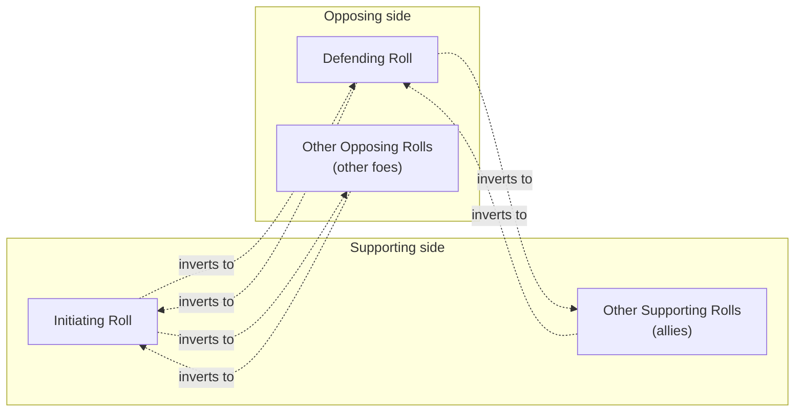
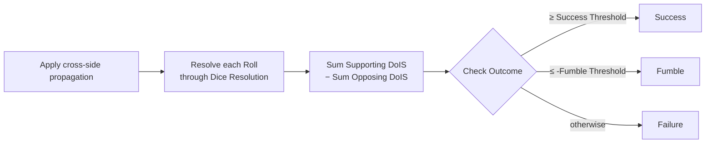

@chapter 3 Check Resolution

# Check Resolution

@player
A **Check** is what happens when an action has a chance of failing — swinging a sword at a creature, sneaking past a guard, pushing open a stuck door, persuading a noble. Every Check builds on the single-Roll mechanics from the previous chapter; this one is about how multiple Rolls combine when more than one creature has a hand in the result.

@implementation
Owns multi-Roll composition: cross-side modifier propagation, aggregating Degrees of Individual Success across Rolls, and ordering Rolls relative to each other. Single-Roll mechanics live in `dice_resolution_design.md` and are not duplicated here — Check Resolution defers all per-Roll math to the dice resolution domain.

## The shape of a Check

@player
Every Check is two ordered lists of Rolls:

- The **Supporting side** — the participants trying to make the action succeed. Required, never empty.
- The **Opposing side** — the participants trying to make it fail. Often empty (when nothing actively opposes you).

The first Roll on each side has a special name:

- The **Initiating Roll** is the first Supporting Roll. It's the Roll made by the creature actually attempting the action.
- The **Defending Roll** is the first Opposing Roll, when one exists. It's the Roll made by whoever is the primary target. The Opposing side may have Rolls without any Defender (a hazardous environment contributing resistance, for example); in that case the Defender slot is left blank.

Any number of additional Rolls can pile in on either side — an ally throwing in moral support, a second guard joining the patrol — and they aggregate using the rules below.

## Common types

### Roll Lists

@implementation
A Check is two ordered lists of Rolls:

- `supporting_roll_list` — required, non-empty. The first entry is the Initiating Roll.
- `opposing_roll_list` — may be empty. The first entry is either the Defending Roll or null. A null first entry indicates the Check has Opposing Rolls but no Defender.

Each Roll uses the structure defined by the dice resolution domain. Check Resolution does not extend or modify it.

### Per-Roll Result

@implementation
A single Roll's resolved result, as returned by dice resolution's roll-with-TN entry point: `tn`, `starting_value`, `initial_dice`, `reroll_changes`, `nudge_changes`, `final_dice`, `degree_of_individual_success`, `critical_count`, `outcome`. Check Resolution does not interpret these fields; it just collects and forwards them.

## Solo Checks — one Roll, no opposition

@player
The simplest Check has one Supporting Roll and nothing on the Opposing side. It resolves exactly like a Roll from the previous chapter: roll the dice, apply modifiers, score DoIS, classify the Outcome.

The only real reason to call it a "Check" instead of a "Roll" at that point is that the rest of the system speaks in Checks — so when an Ability says "make a Stealth Check," that's a one-Roll Check whose Roll Outcome is also the Check Outcome.

## Opposed Checks — cross-side propagation

@player
When both sides have Rolls, something distinctive happens: **Bonuses and Penalties propagate across sides, inverted.** A Bonus that helps the attacker becomes a Penalty against the defender, and vice versa. This is the rule that lets you skip a separate "attacker rolls, defender rolls, subtract" step — every modifier just lands on the right side automatically.

The rules are uniform once you internalize the two lead roles:

| Roll | Receives inverted entries from |
|---|---|
| **Initiating Roll** | every Opposing Roll |
| **Defending Roll** | every Supporting Roll |
| Other Supporting Rolls | the Defending Roll only |
| Other Opposing Rolls | the Initiating Roll only |

Only Bonus/Penalty entries propagate. A defender's Reroll modifier doesn't affect an attacker's dice, and the Initiator's Starting Value doesn't subtract from the Defender's. The cross-side effect is purely about TN shifting.

### Worked example — Bonus on Initiator becomes Penalty on Defender

@player
The Initiator has a +2 Skill Bonus. The Defender has a +1 Equipment Bonus. There are no other Rolls.

| Roll | Before propagation | After propagation |
|---|---|---|
| Initiator | `[(Skill, +2)]` | `[(Skill, +2), (Equipment, -1)]` |
| Defender | `[(Equipment, +1)]` | `[(Equipment, +1), (Skill, -2)]` |

Each Roll then computes its own TN via the usual per-Type stacking and TN clamping from the Dice Resolution chapter. The Initiator now faces an *easier* TN (its +2 Skill stacks with a small inverted Penalty from the Defender's Equipment), and the Defender faces a *harder* TN (the +1 Equipment is partly canceled by the inverted Skill Penalty).

### Worked example — an ally piles on against the Defender

@player
Two Supporting Rolls (the Initiator with `[(Skill, +5)]` and an unarmed ally with `[]`) face a Defender with `[(Armor, +2)]`.

| Roll | Before propagation | After propagation |
|---|---|---|
| Initiator | `[(Skill, +5)]` | `[(Skill, +5), (Armor, -2)]` |
| Ally | `[]` | `[(Armor, -2)]` |
| Defender | `[(Armor, +2)]` | `[(Armor, +2), (Skill, -5)]` |

The ally's empty list contributes nothing back to the Defender — there's nothing to invert. But the Defender's Armor still propagates to *both* Supporting Rolls (the Defender is the lead Opposer, so it broadcasts to all Supporters). The ally's whole contribution on this Check is to throw an extra DoIS attempt at the Defender, paying the inverted Armor cost in exchange for whatever dice they roll.

## Ascendancy — when raw power tips the scales

@player
Some Bonuses measure training or circumstance; the **Inherent** Bonus measures raw, Tier-derived power. When two sides of a Check aren't in the same league, the gap does more than shift a die or two — the system amplifies it with the **Ascendancy** modifier.

It works on the Inherent entries on a Roll, and nothing else. It is **not** a Check step — it's derived per Roll during TN computation (Roll Resolution), so any Roll with an Inherent imbalance gets it, combat or not (an Affliction save, which carries the saver's Inherent Bonus and the inflicter's Inherent Penalty, is amplified the same way):

1. For a combat Check, propagation runs first, so each Roll holds its own Inherent Bonus plus the other side's Inherent as an inverted Inherent Penalty. (A one-sided Roll like a save already has both entries.)
2. TN computation compares the Roll's strongest Inherent Bonus `B` with its strongest Inherent Penalty `P` (only the strongest of each counts, exactly like per-Type stacking).
3. If they differ, the Roll gains one extra entry: an **Ascendancy Bonus of 2 × the gap** (rounded down) when its own Inherent is stronger, or an **Ascendancy Penalty of 2 × the gap** when the Penalty is stronger. If they balance, nothing is added.

The **gate**: a Roll derives Ascendancy only when it carries an Inherent **Penalty** (an Inherent entry of value ≤ 0). A lone Inherent Bonus has no opponent, so it derives nothing; an opposed skill check, carrying no Inherent entries at all, likewise sees no Ascendancy. Nobody passes a Tier to Check Resolution; the Inherent entries carry all the information. One wrinkle inherited from the Tier table: a Tier-0 creature's Inherent is 0, so a combat builder **injects a +0 Inherent Penalty** against a Tier-0 opponent precisely so the gate fires — and a zero side of the comparison counts as **0.5**, the usual Tier-0 convention. Fighting a Tier-0 creature as a Tier 1 is a ±1 Ascendancy pair, not ±2.

### Worked example — Adam, Ben, Carol, and Dawn

@player
Adam makes the Initiating Roll and Ben supports him; Dawn makes the Defending Roll and Carol opposes alongside her.

**Everyone equal.** All four carry `Inherent +2`. After propagation each Roll holds `+2` and a crossed `−2` — balanced. **No one gets an Ascendancy.**

**Adam +2 vs Dawn +1.** Adam ends with his `Inherent +2`, Dawn's crossed `Inherent −1`, and — one point ahead — an `Ascendancy +2` Bonus. Dawn gets the exact opposite: `Inherent +1`, `Inherent −2`, `Ascendancy −2`. Out-classing your opponent helps twice over.

**Adam +2 vs Dawn +1 and Carol +3.** Adam receives both Opposers' Inherents, but only the strongest (Carol's `−3`) counts against his `+2` — one point behind, so `Ascendancy −2`. Carol, facing Adam's crossed `−2` with her `+3`, gains `Ascendancy +2`. Dawn, facing the same `−2` with her `+1`, takes `Ascendancy −2`. Even though Carol and Dawn are on the same side, each measures her own standing against the opposition.

## Aggregating to the Check's Degree of Success

@player
After every Roll resolves on its own, sum them across the two sides:

**Degree of Success = (sum of Supporting DoIS) − (sum of Opposing DoIS)**

When this number is negative, its absolute value is the **Degree of Failure** — used by anything (damage, follow-on effects) that scales with how badly you missed.

### Worked example — three Supporting Rolls, two Opposing

@player

| Side | Roll | DoIS |
|---|---|---|
| Supporting | Initiator | +3 |
| Supporting | Ally A | +1 |
| Supporting | Ally B | −1 |
| Opposing | Defender | +2 |
| Opposing | Hazard | +1 |

Degree of Success = (3 + 1 + (−1)) − (2 + 1) = 3 − 3 = **0**.

A Degree of Success of zero is a Failure — see the threshold rules below.

## From Degree of Success to Check Outcome

@player
The Check Outcome uses the same Default Success / Default Fumble Thresholds the per-Roll classifier uses:

- **Success** if Degree of Success ≥ Default Success Threshold, which is {{Default Success Threshold}}.
- **Fumble** if Degree of Success ≤ −Default Fumble Threshold, which is −{{Default Fumble Threshold}}.
- **Failure** otherwise — including a Degree of Success of exactly zero.

Unlike a single Roll, a Check **can always Fumble**. The per-Roll rule that says "a Roll with `failure_modifier = 0` can't Fumble" doesn't propagate to the Check level — even if every Supporting Roll individually ignores its 1s, the Check as a whole can still Fumble if its Degree of Success drops far enough below zero.

## Ordering-only Checks

@player
Some uses of the dice system aren't really about Success or Failure — they're about ordering Rolls relative to each other. A footrace, a Stealth-versus-Stealth chase, "who notices the assassin first." For those, Check Resolution has a separate entry point that:

- Runs Dice Resolution's no-TN ordering Roll on each input Roll
- Compares the resulting Dice Result Strings
- Returns a sorted permutation (ties broken by original list index)

There's no cross-side propagation, no DoIS aggregation, and no Outcome — the deliverable is just the order. If you need to break ties differently, reorder the results yourself afterward.

## Public entry points

### Compute Check parameters

@implementation
Pure calculation — no dice rolled. Applies cross-side modifier propagation to each Roll's `bonus_penalty_list`, then asks dice resolution to compute each Roll's TN and Starting Value (dice resolution derives the Tier-mismatch Ascendancy entry itself, during TN computation — see **Ascendancy** below).

Input: a Check (two Roll lists).

Returns: parallel lists of `{tn, starting_value}` results. The list shapes match the input — `supporting_results[i]` corresponds to `supporting_roll_list[i]`, and similarly for opposing.

Used by interfaces that preview a Check before rolling — for example, a tooltip showing what TN each participant would face.

### Resolve a Check

@implementation
The full pipeline. Applies cross-side propagation, runs each Roll through dice resolution's full roll-with-TN entry point (which derives the Ascendancy entry from the propagated Inherent imbalance), aggregates per-Roll results into the Check-level Degree of Success, and classifies the Check Outcome.

Input: a Check.

Pipeline:
1. Apply cross-side propagation to produce a propagated copy of each Roll. Ascendancy is no longer a Check step — TN computation derives it per Roll. See **Cross-side propagation** and **Ascendancy** below.
2. For each prepared Roll, invoke the roll-with-TN entry point in dice resolution.
3. Sum DoIS from Supporting results minus DoIS from Opposing results to produce `degree_of_success`.
4. Classify `degree_of_success` against the outcome thresholds via the dice resolution classifier. See **Check Outcome classification** below.

Returns:

| Field | Type | Description |
|---|---|---|
| `supporting_results` | list of Per-Roll Result | Aligned with `supporting_roll_list`. |
| `opposing_results` | list of Per-Roll Result | Aligned with `opposing_roll_list`. May be empty. |
| `degree_of_success` | signed integer | Sum of Supporting DoIS minus sum of Opposing DoIS. |
| `outcome` | Check Outcome (success, failure, or fumble) | Derived from `degree_of_success`. |

Callers that walk the resolution step-by-step (e.g., a UI that lets the GM fudge dice between Rolls) can call dice resolution's per-Roll entry point directly and aggregate themselves; this entry point is the convenience bundle for "resolve everything at once."

### Roll and Sort

@implementation
For Rolls used purely for relative ordering — no TN, no Successes, no propagation. Calls dice resolution's no-TN roll entry point on each Roll, then sorts the resulting Dice Result Strings descending (lex compare).

Input: a list of Rolls.

Returns:

| Field | Type | Description |
|---|---|---|
| `results` | list of dice resolution no-TN results | Aligned with the input list. |
| `order` | list of integers | A permutation of `[0..n-1]`. The first entry is the index of the Roll that ordered highest. |

Tie-breaking is by original list index — the Roll appearing earlier in the input list wins ties. Callers needing a different tie-breaker reorder `results` themselves after this returns.

This entry point does not apply cross-side propagation, does not aggregate, and does not classify a Check Outcome. It is a self-contained helper for ordering use cases.

## Operations

### Cross-side propagation

@implementation
Bonuses and Penalties on Rolls on one side are inverted (Bonus ↔ Penalty) and added to the `bonus_penalty_list` of specific Roll(s) on the other side. The propagation rules:

- The Initiating Roll receives inverted entries from **every** Opposing Roll.
- The Defending Roll receives inverted entries from **every** Supporting Roll.
- Other Supporting Rolls receive inverted entries from the Defending Roll only.
- Other Opposing Rolls receive inverted entries from the Initiating Roll only.

Only `bonus_penalty_list` propagates. `starting_contribution` and Roll Modifiers (reroll, nudge, failure modifier, critical modifier) do not. A Defender's reroll doesn't affect the Initiator's dice; a Supporting ally's `starting_contribution` doesn't affect anyone else's Starting Value.

The propagation is structural — every entry in a Roll's `bonus_penalty_list` propagates per the rules above, **except** Bonus Types named in the Roll's optional **`no_propagate`** field (a list of Bonus Type names). Those entries stay on the Roll's own side: the Roll's own Target Number still includes them, but they are **not** inverted onto the opponent. (A Dodge uses this so its Competency helps the dodger's own Roll without penalizing the attacker.)

Every Bonus Type keeps its name when it crosses — an opponent's Inherent Bonus arrives as an Inherent Penalty. The Tier-mismatch **Ascendancy** amplification then reads that imbalance, but it is no longer a Check operation: it is derived per Roll during TN computation (see **Ascendancy** below).

When `opposing_roll_list` is empty, no Opposing Roll exists to propagate from, and the Initiating Roll receives no inverted entries. Other Supporting Rolls also receive no inverted entries (they would have received them from a non-existent Defending Roll). The Check resolves with Supporting-side DoIS only.

### Ascendancy

@implementation
The Tier-mismatch Ascendancy amplification is **not** a Check Resolution step. It is derived per Roll, from the Roll's own Inherent imbalance, as a step of **TN computation** (Roll Resolution) — see `../dice_resolution/dice_resolution_design.md` → *Ascendancy*. Moving it there lets *any* Roll with an Inherent Penalty derive it, not only combat Checks (an Affliction save, composed one-sidedly, gets it too).

Check Resolution's only role is to deliver the Inherent entries the derivation reads: cross-side propagation inverts each side's Inherent onto the other as an Inherent Penalty (keeping its name), so after propagation a Roll holds its own Inherent Bonus plus the strongest opponent's Inherent as a Penalty. The amplification then doubles that gap at TN time.

Worked examples — Adam is the Initiating Roll, Dawn the Defending Roll, Carol another Opposing Roll. The lists shown are **after propagation**, before TN computation derives each Roll's Ascendancy:

1. **Everyone equal.** All Rolls carry `Inherent +2`; each ends with `Inherent +2` and a crossed `Inherent −2` — balanced, so TN computation derives **no Ascendancy anywhere**.
2. **Adam +2 vs Dawn +1.** Adam ends `Inherent +2`, `Inherent −1` (Dawn's, crossed) → TN computation derives `Ascendancy +2`. Dawn ends `Inherent +1`, `Inherent −2` → `Ascendancy −2`.
3. **Adam +2 vs Dawn +1 (defending) and Carol +3 (opposing).** Adam receives every Opposer's Inherent (−1 and −3); per-Type stacking counts only the −3 → `Ascendancy −2`. Carol receives Adam's +2 (`Inherent +3`, `Inherent −2`) → `Ascendancy +2`. Dawn receives the +2 (`Inherent +1`, `Inherent −2`) → `Ascendancy −2`.

Combat is what places Inherent entries on Rolls — a Creature's own Tier Inherent on its attack, cast, and defense Rolls (emitted even at Tier 0, as a `0`, so it crosses and the opponent's Ascendancy gate fires; a Spell's Tier rides the casting Roll as a **Guidance** Bonus, not an Inherent, so it stays out of the Ascendancy). When one side does not roll at all (a No-defense attack), the combat builder injects the un-rolled side's Inherent, negated — `0` included — so the gap, and the derived Ascendancy, match the defended case. Opposed *skill* checks carry no Inherent entries and so derive nothing.

### Spread Check (area effects)

@implementation
A Check flagged `spread: true` models an **area effect**: one Supporting side (the caster, plus any supports) opposed by *N independent* Opposing Rolls — every creature caught in the spell's footprint makes its own Save. **None of the Opposers is the singular Target / Defending Roll**; they are peers, each opposed only to the caster.

A Spread Check **prepares exactly like any other** (the standard bidirectional cross-side propagation; TN computation then derives each Roll's Ascendancy from its propagated Inherent imbalance) — it only **aggregates differently**:

- **Preparation is bidirectional**, so the caster and every Opposer exchange bonuses: the caster's casting bonuses (Competency, the caster's own Tier Inherent, the Spell's Tier as a Guidance Bonus, …) invert onto **each** caught creature's Save, and every Opposer's bonuses invert back onto the caster. TN computation then derives each Roll's Ascendancy from its Inherent imbalance: every caught creature measures against the caster's Inherent, while the caster — having received every Opposer's Inherent — measures against the strongest creature it caught (per-Type stacking counts only the deepest crossed Penalty).
- **Resolution is per-Opposer.** The Supporting side resolves once into a single Supporting DoIS total; each Opposing Roll then resolves and nets independently: `degree_of_success_i = Σ Supporting DoIS − Opposer_i DoIS`, classified into its own Outcome. There is **no single Check-level Degree of Success** — the result is one Outcome per caught creature.

A non-spread Check uses the same preparation but the pooled aggregation `Σ Supporting − Σ Opposing`.

### Check Outcome classification

@implementation
Once `degree_of_success` is computed, the Check Outcome is derived by calling dice resolution's "classify a value against outcome thresholds" entry point with `can_fumble = true`. The Default Success and Default Fumble Thresholds applied are the dice resolution config values.

A Check can always Fumble — the Roll-level "failure_modifier == 0 suppresses Fumble" rule does not apply at the Check level.

## Cross-domain interactions

@implementation
- Callers in higher-level domains construct a Check from per-creature Rolls and invoke either the parameters-only or full-resolution entry point.
- Cross-side propagation is a Check Resolution operation; the dice domain has no awareness of Check sides or propagation.
- Check Outcome classification is delegated to the dice resolution classifier so Default Success and Default Fumble Thresholds remain owned by dice resolution.

## What lives in the next chapter

@player
The next chapter, **Conditions**, covers the per-Creature state that drives many of the Bonuses, Penalties, and Failures the Dice and Check chapters keep referring to: hit points and damage Severity, Afflictions and saves, Mana, Magic Toxicity, Shock. The Roll and Check mechanics from these two chapters are the engine that resolves all of it.
