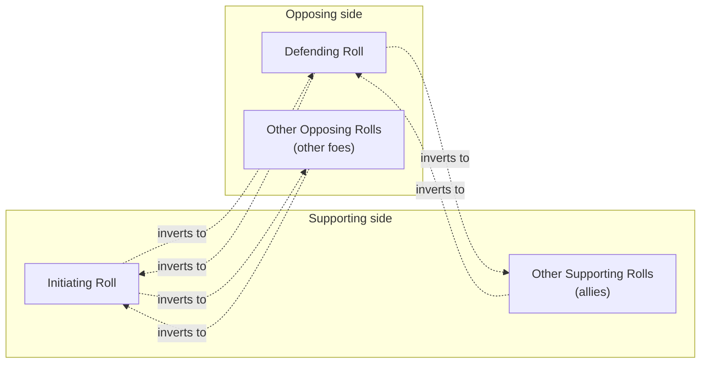
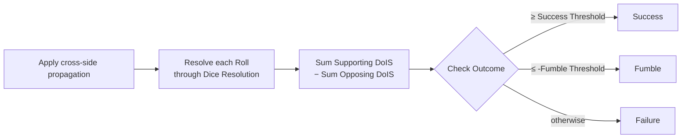

# Check Resolution

A **Check** is what happens when an action has a chance of failing — swinging a sword at a creature, sneaking past a guard, pushing open a stuck door, persuading a noble. Every Check builds on the single-Roll mechanics from the previous chapter; this one is about how multiple Rolls combine when more than one creature has a hand in the result.

> **Reference docs.** Implementer-facing rules live in `check_resolution_design.md` and `check_resolution_tests.md`. This chapter is the player-facing tour. When they disagree, the design doc is canonical.

## The shape of a Check

Every Check is two ordered lists of Rolls:

- The **Supporting side** — the participants trying to make the action succeed. Required, never empty.
- The **Opposing side** — the participants trying to make it fail. Often empty (when nothing actively opposes you).

The first Roll on each side has a special name:

- The **Initiating Roll** is the first Supporting Roll. It's the Roll made by the creature actually attempting the action.
- The **Defending Roll** is the first Opposing Roll, when one exists. It's the Roll made by whoever is the primary target. The Opposing side may have Rolls without any Defender (a hazardous environment contributing resistance, for example); in that case the Defender slot is left blank.

Any number of additional Rolls can pile in on either side — an ally throwing in moral support, a second guard joining the patrol — and they aggregate using the rules below.

## Solo Checks — one Roll, no opposition

The simplest Check has one Supporting Roll and nothing on the Opposing side. It resolves exactly like a Roll from the previous chapter: roll the dice, apply modifiers, score DoIS, classify the Outcome.

The only real reason to call it a "Check" instead of a "Roll" at that point is that the rest of the system speaks in Checks — so when an Ability says "make a Stealth Check," that's a one-Roll Check whose Roll Outcome is also the Check Outcome.

## Opposed Checks — cross-side propagation

When both sides have Rolls, something distinctive happens: **Bonuses and Penalties propagate across sides, inverted.** A Bonus that helps the attacker becomes a Penalty against the defender, and vice versa. This is the rule that lets you skip a separate "attacker rolls, defender rolls, subtract" step — every modifier just lands on the right side automatically.

The rules are uniform once you internalize the two lead roles:

| Roll | Receives inverted entries from |
|---|---|
| **Initiating Roll** | every Opposing Roll |
| **Defending Roll** | every Supporting Roll |
| Other Supporting Rolls | the Defending Roll only |
| Other Opposing Rolls | the Initiating Roll only |

Only Bonus/Penalty entries propagate. A defender's Reroll modifier doesn't affect an attacker's dice, and the Initiator's Starting Value doesn't subtract from the Defender's. The cross-side effect is purely about TN shifting.

### Worked example — Bonus on Initiator becomes Penalty on Defender

The Initiator has a +2 Skill Bonus. The Defender has a +1 Equipment Bonus. There are no other Rolls.

| Roll | Before propagation | After propagation |
|---|---|---|
| Initiator | `[(Skill, +2)]` | `[(Skill, +2), (Equipment, -1)]` |
| Defender | `[(Equipment, +1)]` | `[(Equipment, +1), (Skill, -2)]` |

Each Roll then computes its own TN via the usual per-Type stacking and TN clamping from the Dice Resolution chapter. The Initiator now faces an *easier* TN (its +2 Skill stacks with a small inverted Penalty from the Defender's Equipment), and the Defender faces a *harder* TN (the +1 Equipment is partly canceled by the inverted Skill Penalty).

### Worked example — an ally piles on against the Defender

Two Supporting Rolls (the Initiator with `[(Skill, +5)]` and an unarmed ally with `[]`) face a Defender with `[(Armor, +2)]`.

| Roll | Before propagation | After propagation |
|---|---|---|
| Initiator | `[(Skill, +5)]` | `[(Skill, +5), (Armor, -2)]` |
| Ally | `[]` | `[(Armor, -2)]` |
| Defender | `[(Armor, +2)]` | `[(Armor, +2), (Skill, -5)]` |

The ally's empty list contributes nothing back to the Defender — there's nothing to invert. But the Defender's Armor still propagates to *both* Supporting Rolls (the Defender is the lead Opposer, so it broadcasts to all Supporters). The ally's whole contribution on this Check is to throw an extra DoIS attempt at the Defender, paying the inverted Armor cost in exchange for whatever dice they roll.

## Ascendancy — when raw power tips the scales

Some Bonuses measure training or circumstance; the **Inherent** Bonus measures raw, Tier-derived power. When two sides of a Check aren't in the same league, the gap does more than shift a die or two — the system amplifies it with the **Ascendancy** modifier.

It works on the Inherent entries left behind by propagation, and nothing else:

1. Propagation runs as usual, so each Roll now holds its own Inherent Bonus plus the other side's Inherent as an inverted Inherent Penalty.
2. Each Roll compares its strongest Inherent Bonus `B` with its strongest Inherent Penalty `P` (only the strongest of each counts, exactly like per-Type stacking).
3. If they differ, the Roll gains one extra entry: an **Ascendancy Bonus of 2 × the gap** (rounded down) when its own Inherent is stronger, or an **Ascendancy Penalty of 2 × the gap** when the crossed Penalty is stronger. If they balance — or the Roll has no Inherent entries at all — nothing is added.

That's the whole rule. Nobody passes a Tier to Check Resolution; the Inherent entries carry all the information, and only combat Rolls carry Inherent entries — so an opposed skill check never sees an Ascendancy. One wrinkle inherited from the Tier table: a Tier-0 creature's Inherent is 0, so it contributes no entry — when a Roll *does* have Inherent entries, a zero or missing side of the comparison counts as **0.5**, the usual Tier-0 convention. Fighting a Tier-0 creature as a Tier 1 is a ±1 Ascendancy pair, not ±2.

### Worked example — Adam, Ben, Carol, and Dawn

Adam makes the Initiating Roll and Ben supports him; Dawn makes the Defending Roll and Carol opposes alongside her.

**Everyone equal.** All four carry `Inherent +2`. After propagation each Roll holds `+2` and a crossed `−2` — balanced. **No one gets an Ascendancy.**

**Adam +2 vs Dawn +1.** Adam ends with his `Inherent +2`, Dawn's crossed `Inherent −1`, and — one point ahead — an `Ascendancy +2` Bonus. Dawn gets the exact opposite: `Inherent +1`, `Inherent −2`, `Ascendancy −2`. Out-classing your opponent helps twice over.

**Adam +2 vs Dawn +1 and Carol +3.** Adam receives both Opposers' Inherents, but only the strongest (Carol's `−3`) counts against his `+2` — one point behind, so `Ascendancy −2`. Carol, facing Adam's crossed `−2` with her `+3`, gains `Ascendancy +2`. Dawn, facing the same `−2` with her `+1`, takes `Ascendancy −2`. Even though Carol and Dawn are on the same side, each measures her own standing against the opposition.

## Aggregating to the Check's Degree of Success

After every Roll resolves on its own, sum them across the two sides:

**Degree of Success = (sum of Supporting DoIS) − (sum of Opposing DoIS)**

When this number is negative, its absolute value is the **Degree of Failure** — used by anything (damage, follow-on effects) that scales with how badly you missed.

### Worked example — three Supporting Rolls, two Opposing

| Side | Roll | DoIS |
|---|---|---|
| Supporting | Initiator | +3 |
| Supporting | Ally A | +1 |
| Supporting | Ally B | −1 |
| Opposing | Defender | +2 |
| Opposing | Hazard | +1 |

Degree of Success = (3 + 1 + (−1)) − (2 + 1) = 3 − 3 = **0**.

A Degree of Success of zero is a Failure — see the threshold rules below.

## From Degree of Success to Check Outcome

The Check Outcome uses the same Default Success / Default Fumble Thresholds the per-Roll classifier uses:

- **Success** if Degree of Success ≥ Default Success Threshold.
- **Fumble** if Degree of Success ≤ −Default Fumble Threshold.
- **Failure** otherwise — including a Degree of Success of exactly zero.

Unlike a single Roll, a Check **can always Fumble**. The per-Roll rule that says "a Roll with `failure_modifier = 0` can't Fumble" doesn't propagate to the Check level — even if every Supporting Roll individually ignores its 1s, the Check as a whole can still Fumble if its Degree of Success drops far enough below zero.

## Ordering-only Checks

Some uses of the dice system aren't really about Success or Failure — they're about ordering Rolls relative to each other. A footrace, a Stealth-versus-Stealth chase, "who notices the assassin first." For those, Check Resolution has a separate entry point that:

- Runs Dice Resolution's no-TN ordering Roll on each input Roll
- Compares the resulting Dice Result Strings
- Returns a sorted permutation (ties broken by original list index)

There's no cross-side propagation, no DoIS aggregation, and no Outcome — the deliverable is just the order. If you need to break ties differently, reorder the results yourself afterward.

## What lives in the next chapter

The next chapter, **Conditions**, covers the per-Creature state that drives many of the Bonuses, Penalties, and Failures the Dice and Check chapters keep referring to: hit points and damage Severity, Afflictions and saves, Mana, Magic Toxicity, Shock. The Roll and Check mechanics from these two chapters are the engine that resolves all of it.
