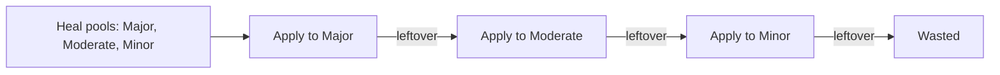
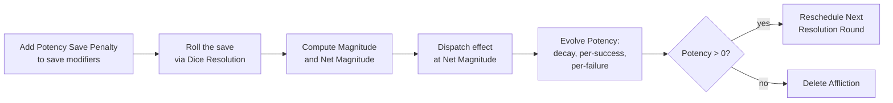

# Conditions

Everything in the previous two chapters was about resolving a single moment — a Roll, a Check. This chapter is about everything that *persists* across those moments: the hit points the Creature has lost, the poison still in their veins, the Bardic Inspiration still ringing in their ears, the magical exhaustion piling up. Together this is called the Creature's **Conditions State**, and it's the storehouse of state every other domain reads from and writes to.

> **Reference docs.** Implementer-facing rules live in `conditions_design.md`, `conditions_tests.md`, `conditions_config.yaml`, and the catalogs in `conditions_afflictions.yaml` / `conditions_effect_names.yaml`. This chapter is the player-facing tour.

## A snapshot of a Creature's state

At any moment, a Creature carries the following pieces of state. Most start at zero or empty.

| Field | What it tracks |
|---|---|
| **HP Damage** | Wounds taken, bucketed by Severity (Minor / Moderate / Major). |
| **Ability Damage** | Damage dealt to individual attribute scores, also by Severity. |
| **Temporary Hit Points** | A single magical pool that absorbs incoming damage before HP. |
| **Mana Spent** | How much Mana the Creature has burned since last at full. |
| **Magic Toxicity** | Accumulated exposure to magical effects. |
| **Shock** | Battlefield disorientation that eats into the Combat Pool. |
| **Acid Counter** | Lingering acid still eating through armor and skin. |
| **Active Afflictions** | Ongoing poisons, diseases, curses, bleeds. |
| **Active Effects** | Modifiers currently applied — Bonuses, Penalties, named flags from spells or gear. |

Each of these has its own rules for how it accumulates, how it resolves, and how it goes away. The rest of the chapter walks them in roughly the order you'll encounter them at the table.

## Hit Points and Damage Severity

Hit points don't decrement from a single pool. Damage is bucketed by **Severity**:

- **Minor Damage** — bruises and shallow cuts. Heals fastest.
- **Moderate Damage** — lacerations and bone fractures. Heals slower.
- **Major Damage** — internal injuries and broken bones. Heals slowest.

The Combat domain decides which Severity each incoming hit lands at — the rules for that live in Combat, not here. Conditions' job is to apply the damage once it arrives and route it through any defenses in the way.

### Temporary Hit Points soak first, worst-first

A Creature can have **at most one Temporary HP grant** active at a time — a single magical reservoir from a spell, a potion, a Bardic Inspiration, whatever. When damage comes in, Temporary HP is consumed *before* any real damage lands.

The grant drains worst-first: Major damage tries to be absorbed before Moderate, Moderate before Minor. The Temporary HP pool is a single running counter — once it's spent, it's gone, and any remaining incoming damage goes to the actual HP counters.

> **Single-grant replacement.** A new Temporary HP grant only replaces the existing one if it has a *strictly larger* amount. A 5-point grant doesn't override an existing 7-point grant. A 5-point grant offered against an existing 5-point grant is also rejected — there's no point in swapping equal pools. An amount of zero or less clears the grant unconditionally.

### Healing cascades down, worst-first

A heal also targets each Severity. If the heal directed at a Severity exceeds the damage at that Severity, the leftover **cascades down** to the next-worse Severity. Excess past Minor is wasted (it doesn't loop back upward).

Worst-first matches the idea that you'd rather close a sucking chest wound than a paper cut, even if the spell could do either. A heal of `{minor: 1, moderate: 1, major: 1}` against a Creature with 0 Major / 3 Moderate / 0 Minor will heal **2 Moderate**, not 1 Moderate and 1 wasted Minor.

## Ability Damage

Ability Damage works the same way as HP Damage but applied per attribute instead of to a shared HP pool. A drained-of-Strength fighter and a sleep-poisoned scholar both carry Ability Damage, but in different attributes.

Two extra rules:

- **Severity still applies.** A `+2 Major Strength` and a `+1 Moderate Strength` aren't the same counter — they live in different buckets and heal at different rates.
- **Within a Severity, healing pops FIFO.** If you took Major Strength damage and then Major Dexterity damage, a Major-targeted Ability heal recovers your Strength first. The rule preserves the order in which attributes were *first* affected at that Severity, which lines up with the intuition "you've been carrying this damage longer, it has had time to start closing."

## Mana

A Creature's Mana is a single integer: `mana_spent`. Their **Mana Max** is owned by the Creatures domain and passed in whenever Conditions needs it. **Current Mana** is just `mana_max − mana_spent`.

There are three knobs:

- **Apply Mana Cost** increases `mana_spent`, capped at `mana_max`. You cannot spend more than you have.
- **Restore Mana** decreases `mana_spent`, floored at zero.
- **Set Mana Spent** clamps the value to `[0, mana_max]`.

Mana doesn't have Severities. It doesn't cascade. It's just a number that goes up when you cast and down when you rest.

## Magic Toxicity

Every magical effect that touches a Creature — beneficial buffs, healing potions, harmful magic, environmental exposure — leaves a residue called **Magic Toxicity**. Each Creature has a **Toxicity Threshold** based on their Charisma and Tier (default formula: `floor(charisma × tier)`, with Tier 0 treated as 0.5). Toxicity above that threshold starts hurting the Creature.

Every call to apply Toxicity comes tagged as one of two kinds:

- **`positive`** — a beneficial source. Magical healing, voluntary attunement, buffs you wanted.
- **`forced`** — anything else. Harmful magic, environmental exposure, side effects of effects you didn't choose.

The two interact with the threshold differently:

**Toxicity Block.** If the call is `positive` *and* the Creature's current Magic Toxicity is **strictly above** the threshold, the call is rejected outright. Magic Toxicity doesn't increase, the beneficial effect doesn't happen, and the caller has to decide what to do about it. This is the rule that says "a Creature who has been buffed past their tolerance can't *accept* another buff — their body is already saturated."

**Toxicity Damage.** When a Toxicity application is *accepted*, the portion of the increase that lands *above* the threshold turns into Charisma Ability Damage at the configured Severity (Major by default). The bookkeeping is:

> `damage = max(0, magic_toxicity_after − threshold) − max(0, magic_toxicity_before − threshold)`

Three patterns fall out cleanly:

- Started below the threshold, stayed below → zero damage.
- Started below, ended above → damage equal to the overshoot past threshold.
- Started above → damage equal to the full increase (every point landed above the threshold).

`forced` calls are never blocked, but they still incur Toxicity Damage on the portion past the threshold — environmental magic doesn't care about your tolerance, but it still poisons you. `positive` calls that *aren't* blocked also incur Toxicity Damage on the portion past the threshold; the block rule and the damage rule are independent.

## Afflictions

An **Affliction** is an ongoing negative condition with a name (`bleeding`, `ghoul_fever`, `krithrak_spider_venom`) — what other systems would call a "status effect" or "disease." Each Affliction Rule lives in `conditions_afflictions.yaml` and declares its save attribute, category (poison, disease, curse, bleed, other), how often it resolves, and what happens when it resolves.

A Creature carries Afflictions in a list. Each entry tracks three values:

- **Potency** — the Affliction's current strength. ≥ 1 while the entry exists; if it ever falls to 0 the entry is deleted.
- **Inflicter Tier** — the highest Tier among the sources that inflicted this Affliction since it last cleared. Useful when an effect scales by the inflicter's Tier.
- **Next Resolution Round** — the absolute round number at which this Affliction is next due to resolve.

When a new source inflicts an Affliction the Creature is already carrying, Potency adds together and Inflicter Tier rises to the max. When the Potency-zero entry is later re-inflicted, it's added to the *end* of the list, not its previous position.

### Resolving an Affliction

Once an Affliction comes due, the resolution runs in a fixed order:

**The Potency Save Penalty** is a Competency Penalty equal to `floor(potency / Potency Divisor)` — the worse your Affliction has gotten, the harder it is to save against it. It's auto-merged into the save Roll's modifier list; the caller doesn't add it.

**Magnitude** is `1 + floor(potency / Potency Divisor)` — the `+1` ensures a fresh Potency-1 Affliction still produces magnitude 1. **Net Magnitude** is `max(0, magnitude − successes)` — every Success on the save shaves a point off how much damage you take. A fully-saved resolution lands at Net Magnitude 0 and applies nothing.

**Effect dispatch** depends on the Affliction Rule:

- `hit_point_damage` — applies Net Magnitude points of HP damage at the named Severity.
- `ability_damage` — same, but to a named attribute as Ability Damage.
- `named_effect` — applies a named Active Effect (see below) for some duration. Magnitude is binary: any Net Magnitude above zero applies the effect; zero does not.

**Potency evolution** uses three Affliction Rule values:

> `potency_delta = −floor(potency_decay) − floor(successes × potency_per_success) + floor(failures × potency_per_failure)`

So Affliction Rules tune how the Potency moves over time: some shrink slowly under their own decay; some shrink fast on successful saves; some grow on failures.

### Worked example — Bleeding ticks down

`bleeding` is defined as `category: "bleed", potency_per_success: "tier", potency_per_failure: 0`, with a `hit_point_damage` effect at `minor` Severity. The literal `"tier"` substitutes the Creature's Tier at resolution time.

A Tier 2 Creature carries Bleeding at Potency 3 and resolves it. The save Roll (with a `-floor(3 / Potency Divisor)` Competency Penalty already merged) produces DoIS = +1, so successes = 1, failures = 0. Magnitude = `1 + floor(3 / Potency Divisor)`. Net Magnitude = magnitude − 1. The Creature takes that many Minor HP. Then Potency evolves: `−floor(potency_decay) − floor(1 × 2) + floor(0 × 0) = −potency_decay − 2`. With the default `potency_decay = 0`, Potency drops from 3 to 1. Bleeding survives; it gets rescheduled to the next round.

## Active Effects

An **Active Effect** is a modifier currently in effect on a Creature — a `+2 Skill Bonus from Bardic Inspiration`, a `-1 Penalty from being Prone`, a "Paralyzed" flag, anything that adjusts the Creature's behavior without permanently changing it.

Every Active Effect carries a **Source ID** — an opaque string from whoever applied it. Effects are stored under a single rule: **replace by Source ID**. Apply the same Source ID twice, the second call overwrites the first in place. This is the seam equipment changes ride on — when you swap a sword, the Equipment domain re-applies the new sword's Effects with the same Source IDs, and the old ones get replaced.

The "biggest Bonus and largest Penalty per Bonus Type win" rule from the Dice chapter is **not** enforced at storage time. Active Effects are stored permissively — you can have two `+2 Skill` Effects from different Source IDs sitting on the list at once. The stacking rule kicks in at *lookup* time: when something asks Conditions "what Skill modifiers apply to this Creature?", Conditions scans the list, groups by Bonus Type, and returns at most one positive and one negative entry per Type.

This split keeps "Apply Effect" cheap and lets callers freely compose modifiers without having to first check whether they'd be shadowed. Removing the largest one doesn't quietly promote the next — the lookup just picks up whichever is largest now.

## Shock

**Shock** is a counter of battlefield disorientation. It's not damage. It doesn't heal on its own. It sits there until consumed.

Combat consumes Shock at the start of a Creature's turn to **reduce the Combat Pool**: the Creature's pool of dice for the round shrinks by however much Shock was consumed. The "Consume Shock" call takes a cap (the size of the pool itself, typically), and consumes `min(shock, cap)` — excess Shock survives into the next round.

That excess is the rule that says "if a fighter was extremely shaken, they'll lose dice for *multiple* rounds, not just one." Shock doesn't decay between rounds — only Combat draining it does.

## Acid Counter

A simple non-negative integer with hardcoded behavior. Acid damage *adds* to the counter rather than dealing damage immediately. Then, at the start of the affected Creature's turn:

1. The counter is **halved** (floored).
2. The post-halving value is dealt as **Minor HP damage** to the Creature.
3. If the counter is now zero, the field is cleared.

A counter at 7 halves to 3, deals 3 Minor, and the Creature carries 3 into the next turn. The halving-first ordering means a freshly-applied acid hit has one round to do nothing visible before it starts ticking; this lets the GM communicate "you've been splashed — get this off you" before the damage cycle starts.

## Natural Recovery

Time heals. **Natural Recovery** is the bulk operation that rolls every per-tick rule forward by `recovery_ticks` worth of elapsed time. In the tabletop game one Recovery Tick is one day, but the project can override the unit in config.

There are two **Recovery Modes**:

- **Slow** — recovery while travelling or otherwise active.
- **Fast** — bed rest, attended care from a healer.

Every Severity, Tier, and Mode pair has its own healing rate in `conditions_config.yaml`, expressed as `[amount, tick_length]` — meaning "this much per this many Ticks." A `tick_length` longer than the elapsed Recovery Ticks heals zero — partial progress is *not* retained between calls. Fast Mode rates are typically twice Slow Mode by default.

What gets healed by Natural Recovery:

- **HP Damage** — per Severity, per Tier, per Mode.
- **Ability Damage** — same.
- **Mana** — `floor(mana_max / Mana Per Recovery Tick Divisor)` points per Tick.
- **Magic Toxicity** — `floor(charisma / Magic Toxicity Per Recovery Tick Divisor)` points per Tick.
- **Temporary HP** — clears entirely, regardless of `ends_on_round`. Time is the natural enemy of Temporary HP.

## Death

A Creature is **Dead** when any one of three **Death Tracks** crosses its threshold:

| Track | Cap |
|---|---|
| HP | `floor(Death Multiplier × max_hit_points)` |
| Ability | `floor(Death Multiplier × attribute_score)` for any single attribute |
| Toxicity | `floor(Death Multiplier × Toxicity Threshold)` |

The HP track is the sum of all Severities of HP damage. The Ability track is per attribute — exceeding the cap on Strength alone is enough; the other attributes don't have to be hurt at all. The Toxicity track is straight `magic_toxicity`.

`Death Multiplier` is a number in config — fractional values let a project tune lethality without altering any Creature-side maximum. A `Death Multiplier` of 2 means a Creature can soak twice their Max HP before dying; a `Death Multiplier` of 1.5 makes them die at +50%.

## What lives in the next chapter

The chapters above are the engine. Future chapters will cover the players and the world that engine runs: Creatures (the attribute scores, Tiers, and Mana Max that Conditions reads), Abilities (the catalog that names what an effect *means*), Combat (Damage Severity decisions, Initiative, turn structure), Magic (Toxicity Sources, Mana costs), and Atlas (Maps, Tokens, Zone Effects). Each one composes against the same Roll → Check → Condition vocabulary you've now seen end to end.
