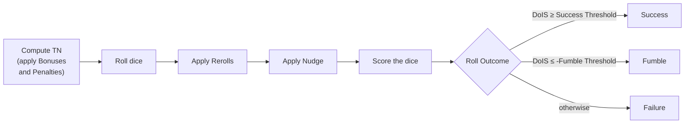

@chapter 2 Dice Resolution

# Dice and Resolution Mechanics

@player
Every Roll in Crimson Steel works the same way: you grab a handful of d{{Die Size}}s, name a Target Number, throw them, and count Successes. The mechanics for *how* you do that — and how the dice you rolled get turned into a yes-or-no answer — live here. Once you've internalized this chapter, every Check, save, attack, and Skill use in the game is a variation on the same theme.

@implementation
Owns single-Roll mechanics: rolling dice, applying reroll and nudge modifiers, computing the Degree of Individual Success, and producing a Dice Result String. Multi-Roll composition (Checks, cross-Roll modifier propagation, ordering across Rolls) lives in `check_resolution_design.md`.

## A Roll, end to end

@player
A **Roll** has four ingredients:

- A **Dice Count** — how many d{{Die Size}}s you throw.
- A **Target Number** — what value a die needs to hit to count as a Success. Always abbreviated **TN**.
- Any number of **Bonuses** and **Penalties** that shift the TN before you roll.
- Optional **Reroll** and **Nudge** modifiers that change dice after they land.

The pipeline runs in this fixed order:

Steps further down only see what the previous steps produced. A Nudge can react to your Reroll, but a Bonus has already done its work by the time you pick up the dice.

## Common types

### Roll

@implementation
The structure consumed by every public entry point. Constructed by the caller from per-creature data (Skill Prowess, Bonuses and Penalties, equipped abilities, etc.).

| Field | Type | Default | Description |
|---|---|---|---|
| `starting_contribution` | signed integer | 0 | Added directly to Starting Value. |
| `bonus_penalty_list` | list of `(type_name, signed_value)` | empty | Each entry's sign determines whether it's a Bonus (positive) or Penalty (negative). Bonus/Penalty Types are opaque. The same Bonus/Penalty Type may appear multiple times. |
| `dice_count` | integer | required | Number of dice to roll. |
| `value_adjustment` | `(value, max)` pair or null | null | The Nudge modifier. `value` is signed; `max` is a boolean that switches between targeted and uniform modes. |
| `positive_reroll` | `(count, max)` pair or null | null | Rerolls non-Successes from lowest first. `max = true` replaces `count` with Maximum Dice Count. |
| `negative_reroll` | `(count, max)` pair or null | null | Rerolls Successes from highest first. `max = true` replaces `count` with Maximum Dice Count. |
| `critical_reroll` | `(count, max)` pair or null | null | Rerolls dice equal to Die Size (Critical Successes), lowest index first. Disadvantageous — strips Crits. `max = true` replaces `count` with Maximum Dice Count. |
| `floor_reroll` | `(count, max)` pair or null | null | Rerolls dice equal to 1, lowest index first. Advantageous — strips natural 1s. `max = true` replaces `count` with Maximum Dice Count. |
| `failure_modifier` | signed integer | -1 | Each Failure's contribution to DoIS. Set to 0 for Rolls that ignore Failures. |
| `critical_modifier` | signed integer | 2 | Each Critical Success's contribution to DoIS. Replaces (does not stack with) the +1 a regular Success would contribute. |

### Per-die contribution to DoIS

@implementation

| Die value | Contribution |
|---|---|
| Die Size | `critical_modifier` |
| 1 | `failure_modifier` |
| ≥ TN (and not Die Size) | +1 |
| Otherwise | 0 |

### Roll Outcome

@implementation
One of three string values:
- `success` — DoIS ≥ Default Success Threshold.
- `fumble` — DoIS ≤ −Default Fumble Threshold *and* `failure_modifier ≠ 0`. Rolls that ignore Failures cannot Fumble.
- `failure` — anything else.

## Anatomy of a die

@player
Each d{{Die Size}} you throw lands in one of four states. The interface renders them like this:

- 1 &nbsp;**Failure** — the die rolled a 1. Subtracts from your Degree of Individual Success.
- 3 &nbsp;**Neutral Result** — between 2 and TN minus 1. Contributes nothing.
- 7 &nbsp;**Success** — meets or exceeds the TN. Adds 1.
- {{Die Size}} &nbsp;**Critical Success** — the die rolled its highest face. Adds 2 (the configured Critical value) instead of the regular 1.

Where Neutral ends and Success begins moves with the TN. At TN 6 a `5` is Neutral; at TN 5 the same die is a Success.

## Bonuses, Penalties, and the TN

@player
Bonuses *lower* the TN (easier to hit), Penalties *raise* it. Every Bonus and Penalty carries a **Bonus/Penalty Type** — the same Type doesn't stack with itself. If you have a +1 Skill Bonus and a +2 Skill Bonus, only the +2 counts; the +1 is wasted because they share a Type. Mix a +2 Skill Bonus with a +1 Equipment Bonus though, and both apply: different Types, no overlap.

After stacking, every contributing Bonus and Penalty sums into the **TN Net Modifier**, which shifts the TN.

The TN can't slide past its hard limits — the Minimum TN of {{Minimum Target Number}} and the Maximum of {{Maximum Target Number}}. If your stack of Bonuses would push the TN below the Minimum, the leftover doesn't disappear — it becomes a **Starting Value**: free Successes added to your DoIS before you even pick up the dice. The same idea in reverse for Penalties: overflow past the Maximum becomes Starting Failures.

### Worked example — overflow becomes free Successes

@player
The Base TN is {{Base Target Number}} and the Minimum TN is {{Minimum Target Number}}. You have a Skill Bonus of +{{Base Target Number - 1}}.

- The TN would drop from {{Base Target Number}} all the way to 1.
- That's {{Minimum Target Number - 1}} below the Minimum.
- The Minimum clamps the TN at {{Minimum Target Number}}.
- The {{Minimum Target Number - 1}} points of overflow become **+{{Minimum Target Number - 1}} Starting Value**.

You now roll your dice against TN {{Minimum Target Number}} and start with +{{Minimum Target Number - 1}} on the scoreboard.

## Counting the result — Degree of Individual Success

@player
Once your dice have landed and any after-the-roll modifiers have fired, you tally:

- **+1** for each Success
- **+2** for each Critical Success (replaces the +1; they don't stack)
- **−1** for each Failure
- **+ Starting Value** (positive or negative)

The total is the Roll's **Degree of Individual Success** — **DoIS** for short.

### Worked example — scoring a Roll

@player
You roll six dice at TN 6 with no Starting Value and land:

7 6 3 10 1 1

| Die | State | Contribution |
|---|---|---|
| 7 | Success | +1 |
| 6 | Success | +1 |
| 3 | Neutral | 0 |
| 10 | Critical Success | +2 |
| 1 | Failure | −1 |
| 1 | Failure | −1 |

**DoIS = 1 + 1 + 0 + 2 − 1 − 1 = +2**.

## From DoIS to Roll Outcome

@player
The DoIS becomes the Roll's verdict using two thresholds from config:

- **Success** if DoIS ≥ Default Success Threshold, which is {{Default Success Threshold}}.
- **Fumble** if DoIS ≤ −Default Fumble Threshold, which is −{{Default Fumble Threshold}} (and the Roll allows Fumbles).
- **Failure** otherwise — including a DoIS of exactly zero.

Some Rolls explicitly *ignore* Failures. Those Rolls can't Fumble either; their 1s simply contribute nothing.

## After-the-roll modifiers

@player
Two kinds of modifier can fire *after* the dice land:

**Reroll.** You designate a count of dice to reroll. A positive Reroll targets non-Successes from lowest first; a negative Reroll targets Successes from highest first. Each die can be rerolled at most once. A *max* Reroll expands the count to the entire dice pool.

**Nudge** (also called Value Adjustment). Shifts a die's face value. A standard Nudge picks one die — the one your shift would help most. A *max* Nudge shifts every die. Values are clamped to the legal range, so a `+1` to a {{Die Size}} just stays at {{Die Size}}.

If a Roll has both, Reroll happens first.

## Public entry points

@implementation
These are the operations other domains call. Internal helpers exist but are not part of the contract.

### Resolve a Roll with a Target Number (Full Roll Outcome)

@implementation
The full pipeline for a single Check participant. Input: a Roll. The pipeline:

1. Compute the Roll's TN and Starting Value from its `bonus_penalty_list` and `starting_contribution`. See **TN Computation** below.
2. Roll `dice_count` dice using the configured Die Size.
3. Apply the Roll's Reroll modifiers. See **Reroll** below.
4. Apply the Roll's Nudge. See **Nudge** below.
5. Score each die's contribution to DoIS, count Crits, classify the Roll Outcome. See **Scoring** below.

Returns:

| Field | Type | Description |
|---|---|---|
| `tn` | integer | The TN used for resolution (after clamping). |
| `starting_value` | signed integer | The Starting Value used for resolution. |
| `initial_dice` | list of integers | The dice as rolled, before any modifier. |
| `reroll_changes` | list (same length as dice) | Per-position rerolled values, or null where unchanged. |
| `nudge_changes` | list (same length as dice) | In standard mode, the targeted die's post-shift value (recorded even when clamping left it unchanged), null elsewhere; in max mode, every die's post-shift value (no nulls). |
| `final_dice` | list of integers | The dice after rerolls and nudges have been applied. |
| `dois` | signed integer | Degree of Individual Success. |
| `critical_count` | integer | Number of dice equal to Die Size in `final_dice`. |
| `outcome` | Roll Outcome | See common types. |

The intermediate fields (`initial_dice`, `reroll_changes`, `nudge_changes`, `final_dice`) are for callers that render per-step state (a UI showing dice before and after each modifier). Callers that only need the result read `dois` and/or `outcome`.

### Resolve a Roll without a Target Number (Full Roll Ordered)

@implementation
Used when a Roll only needs to be ordered against other Rolls — no Successes, no DoIS, no Roll Outcome. Input: a Roll. Only `dice_count`, `value_adjustment`, `positive_reroll`, `negative_reroll`, `critical_reroll`, and `floor_reroll` are read; other fields are ignored.

The pipeline matches the with-TN case but with TN-dependent steps removed:

1. Roll `dice_count` dice.
2. Apply Rerolls. Eligibility uses fixed quartile thresholds rather than a TN: positive rerolls dice with `value < floor(Die Size / 4) + 1`, negative rerolls dice with `value ≥ Die Size - floor(Die Size / 4)`.
3. Apply the Nudge. Standard-mode targeting differs: the target is the die whose post-shift value lands closest to Die Size (positive nudge) or closest to 1 (negative nudge); among dice that tie on closeness, the one that started furthest from that extreme wins. Max mode behaves the same as in the with-TN case.
4. Compute the Dice Result String for the final dice.

Returns:

| Field | Type | Description |
|---|---|---|
| `initial_dice` | list of integers | As rolled. |
| `reroll_changes` | list | Per-position rerolled values or null. |
| `nudge_changes` | list | In standard mode, the targeted die's post-shift value (recorded even when clamping left it unchanged), null elsewhere; in max mode, every die's post-shift value (no nulls). |
| `final_dice` | list of integers | After modifiers. |
| `dice_result_string` | string | ASCII encoding of `final_dice`, sorted descending. See **Dice Result String** below. |

### Translate Skill Prowess into Roll inputs

@implementation
Pure conversion. Input: a signed integer `prowess`.

Returns `{dice_cap, bonus_penalty}`:

- `bonus_penalty = floor(prowess / Dice Count Range)` (floor toward negative infinity)
- `remainder = prowess - (bonus_penalty * Dice Count Range)`
- `dice_cap = Minimum Dice Count + remainder`

Each full Dice Count Range of `prowess` produces one point of `bonus_penalty`; the leftover fills `dice_cap` above the Minimum. Negative `prowess` wraps the other direction — `prowess = -1` produces `bonus_penalty = -1` and `dice_cap` at the Maximum.

`dice_cap` is the maximum number of dice the Creature may spend on a Roll for this Proficiency. The caller assigns it to the Roll's `dice_count` field, or a smaller value if the Creature chooses to spend fewer dice.

`bonus_penalty` is a single signed integer:
- Positive when `prowess` exceeded Dice Count Range — the magnitude becomes a Bonus.
- Negative when `prowess` was below zero — the magnitude becomes a Penalty.
- Zero when `prowess` fit within a single Dice Count Range starting from the Minimum.

Bonus/Penalty Types are not assigned or validated by dice resolution.

The `floor` and explicit `remainder` formulation matters: most languages' integer division truncates toward zero rather than toward negative infinity, which would produce wrong results for negative `prowess`. Implementers should use floor division (Python's `//`, or an explicit floor of the float quotient) and compute the remainder by subtraction rather than relying on the language's `%` operator.

### Compute a Dice Result String

@implementation
ASCII encoding of a list of dice, sorted descending. The encoding is monotonic: higher die value → higher ASCII character. Two strings can be compared with a standard library lex compare to determine which list ordered higher.

Input: a list of integer die values.

Returns: a string of length equal to the input list.

Construction:
1. Read `Dice Result String Encoding` from config. If its length is less than `Die Size − 9`, replace it entirely with `'A'` through `'Z'`.
2. For each die value, sorted descending: emit `'1'`–`'9'` for values 1–9, otherwise emit `encoding[value − 10]`.

Used by `Resolve a Roll without a Target Number` internally, and called by other domains for ordering use cases.

### Classify a value against outcome thresholds

@implementation
Pure conversion. Maps a signed integer to a Roll Outcome using the configured Default Success and Default Fumble Thresholds.

Inputs:
- `value` — signed integer.
- `can_fumble` — boolean. When false, the Fumble check is skipped.

Returns: a Roll Outcome (`success`, `failure`, or `fumble`).

Rules:
- `fumble` when `can_fumble` is true and `value ≤ −Default Fumble Threshold`.
- `success` when `value ≥ Default Success Threshold`.
- `failure` otherwise.

Used internally by Scoring (with `can_fumble = (failure_modifier ≠ 0)`) and called by check resolution to derive a Check Outcome from a Degree of Success.

## Operations

@implementation
These are the rules the public entry points compose. Each rule is stated as a contract, not an algorithm.

### TN computation

@implementation
Reads a Roll's `bonus_penalty_list` and `starting_contribution`. Produces final TN and Starting Value.

The **Ascendancy** entry (below) is derived first, from any Inherent imbalance in the list, and folded in before stacking.

Per-Type stacking: for each Bonus/Penalty Type, only the highest-positive entry and the lowest-negative entry contribute. All other entries on that Type are ignored. The contributing entries from all Types sum into the TN Net Modifier.

Final TN = `clamp(Base Target Number - TN Net Modifier, Minimum Target Number, Maximum Target Number)`.

Starting Value = `starting_contribution` + the TN Net Modifier overflow past the TN bounds, signed:
- A Bonus that pushed TN below Minimum contributes positively (Starting Successes).
- A Penalty that pushed TN above Maximum contributes negatively (Starting Failures).

### Ascendancy (Tier-mismatch amplification)

@implementation
Derived as the first step of **TN computation**, from the Roll's own `bonus_penalty_list` — nothing else is read (Rolls carry no Tier). Because it lives in Roll Resolution, it applies to *every* Roll whose list carries an Inherent imbalance: a combat Roll after Check Resolution's cross-side propagation has delivered the opponent's Inherent as a Penalty, or a one-sided Roll such as an Affliction save (which composes the saver's Inherent Bonus and the inflicter's Inherent Penalty directly).

Compare the Roll's strongest **Inherent** Bonus `B` against its strongest **Inherent** Penalty `P` (both as magnitudes — the same per-Type stacking this operation uses). When they differ, fold one derived entry into the list:

- `B > P` — an **Ascendancy Bonus** of `floor(2 × (B − P))`.
- `P > B` — an **Ascendancy Penalty** of `floor(2 × (P − B))`.
- `B = P` — no entry.

**Gate.** The derivation runs only when the list carries an Inherent **Penalty** — an Inherent entry with value `≤ 0`. A Roll with an Inherent Bonus but no Inherent Penalty involves no other creature and derives nothing; a Roll with no Inherent entries at all (an opposed *skill* check) likewise derives nothing. A Penalty of exactly `0` still fires the gate: a combat builder injects a `+0` Inherent Penalty against a Tier-0 opponent precisely so the gap can be amplified.

The Inherent value stands in for the Tier (the Tier Minimum Inherent Bonus table is `[0, 1, 2, 3, 4, 5]`), so the **Tier 0 counts as 0.5** convention applies: a side of the comparison that is zero reads as `0.5`. A Tier-2 Roll against a Tier-0 opponent (its `+0` Inherent Penalty) gains `floor(2 × (2 − 0.5)) = +3`; `+1` Inherent against `+4` yields `−6`. The amplification doubles the gap: fighting up hurts twice over (the Inherent Penalty *and* the Ascendancy Penalty), fighting down helps twice over.

This is the Roll-Resolution half of the Tier Mismatch rule defined in `../encounter/encounter_design.md`; the Inherent damage-reduction half is applied server-side at damage time. How combat puts the Inherent entries on its Rolls — own Tier on each Roll, the opponent's crossed by propagation or injected against an undefended / Tier-0 target — is in `../check_resolution/check_resolution_design.md`.

### Scoring

@implementation
Reads final dice (rolled dice after Reroll and Nudge), TN, Starting Value, `failure_modifier`, `critical_modifier`. Produces `degree_of_individual_success`, `critical_count`, and `outcome`.

DoIS = Starting Value + sum of per-die contributions across all dice in `final_dice` (see common types).

`critical_count` = number of dice in `final_dice` equal to Die Size.

`outcome` = result of classifying DoIS against the outcome thresholds, with `can_fumble = (failure_modifier ≠ 0)`.

### Reroll

@implementation
A Roll has four slots: `positive_reroll`, `negative_reroll`, `critical_reroll`, and `floor_reroll`. Any combination (or none) may be present. All present slots apply in a single conceptual pass; no die is rerolled more than once.

- Positive: rerolls non-Successes (`value < TN`), preferring lowest values first.
- Negative: rerolls Successes (`value ≥ TN`), preferring highest values first.
- Critical: rerolls dice equal to Die Size (Critical Successes), preferring lowest index first (all eligible dice share the same value).
- Floor: rerolls dice equal to 1, preferring lowest index first.
- `max = true` on a slot replaces that slot's count with Maximum Dice Count.

The positive/negative slots partition the dice into structurally disjoint sets (non-Successes vs. Successes), so a Roll using both never rerolls the same die twice. The critical/floor slots target exact extremes (`value = Die Size`, `value = 1`), which overlap those sets — a Crit is also a Success, a 1 is also a non-Success. To keep the "no die rerolled twice" guarantee, the extreme-value slots claim their dice first; `negative_reroll` and `positive_reroll` then select only from the Successes / non-Successes that remain.

For Rolls without a TN, the positive/negative eligibility is restricted to the bottom and top quartiles of `[1, Die Size]`:
- Positive eligible: `value < floor(Die Size / 4) + 1`.
- Negative eligible: `value ≥ Die Size - floor(Die Size / 4)`.

The critical/floor slots are TN-independent — their eligibility (`value = Die Size`, `value = 1`) is the same with or without a TN.

### Nudge

@implementation
Two modes, selected by the `max` flag in `value_adjustment`.

**Standard mode** (`max = false`). One die is shifted by `value`. Targeting:
- With a TN: the die whose nudged DoIS contribution differs most from its current contribution. Largest positive delta for a positive nudge; largest negative delta for a negative nudge. Tied deltas → the die with the larger change in Critical Count wins: a positive nudge prefers the die that becomes a Critical Success (e.g. a Success → Critical over a Neutral → Success when both raise DoIS by 1), and a negative nudge prefers the die that stops being a Critical Success. Still tied → the die that started lowest (positive nudge) or highest (negative nudge) wins. Still tied → lowest index wins.
- Without a TN: the die whose post-shift value lands closest to Die Size (positive nudge) or closest to 1 (negative nudge). Tied closeness → the die that started furthest from that extreme wins. Still tied → lowest index wins.
- Post-shift value is clamped to `[1, Die Size]`. The targeting always selects a die and records its post-shift value — even when clamping leaves the value unchanged (a `+1` on a die already at Die Size still records that die at Die Size). Non-targeted dice are null.

**Max mode** (`max = true`). Every die is shifted by `value`. Each post-shift value is independently clamped to `[1, Die Size]`. No targeting, no TN involved. Every position records its post-shift value — there are no nulls, even for dice that clamp in place.

### Order of operations

@implementation
Modifiers apply in this fixed order on each Roll:

1. Reroll (positive, negative, critical, and floor slots, in a single pass).
2. Nudge.

## Cross-domain interactions

@implementation
- Callers in higher-level domains construct Roll objects from per-creature state and invoke the public entry points above. They are responsible for sourcing modifiers, assigning Bonus/Penalty Types, and selecting Dice Counts.
- Check resolution invokes the Full Roll Outcome, Full Roll Ordered and Dice Result String entry points above. It does not invoke the Operations directly.
- Configuration is loaded from `dice_resolution_config.yaml` at boot. The file's keys are referenced throughout this document by their human-readable name.

## What lives in the next chapter

@player
This chapter covers a single Roll. **Check Resolution** picks up where it ends: what happens when two or more Rolls collide — opposed Checks, group attacks, Defender versus Initiator. The single-Roll mechanics above don't change; Check Resolution just composes them.
