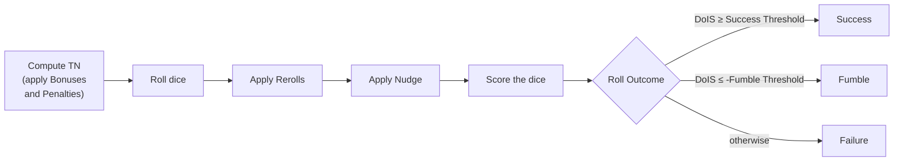

# Dice Resolution

Every Roll in Crimson Steel works the same way: you grab a handful of d10s, name a Target Number, throw them, and count Successes. The mechanics for *how* you do that — and how the dice you rolled get turned into a yes-or-no answer — live here. Once you've internalized this chapter, every Check, save, attack, and Skill use in the game is a variation on the same theme.

> **Reference docs.** The implementer-facing rules live in `dice_resolution_design.md` and `dice_resolution_tests.md`. This chapter is the player-facing tour. When they disagree, the design doc is canonical.

## A Roll, end to end

A **Roll** has four ingredients:

- A **Dice Count** — how many d10s you throw.
- A **Target Number** — what value a die needs to hit to count as a Success. Always abbreviated **TN**.
- Any number of **Bonuses** and **Penalties** that shift the TN before you roll.
- Optional **Reroll** and **Nudge** modifiers that change dice after they land.

The pipeline runs in this fixed order:

Steps further down only see what the previous steps produced. A Nudge can react to your Reroll, but a Bonus has already done its work by the time you pick up the dice.

## Anatomy of a die

Each d10 you throw lands in one of four states. The interface renders them like this:

- 1 &nbsp;**Failure** — the die rolled a 1. Subtracts from your Degree of Individual Success.
- 3 &nbsp;**Neutral Result** — between 2 and TN minus 1. Contributes nothing.
- 7 &nbsp;**Success** — meets or exceeds the TN. Adds 1.
- 10 &nbsp;**Critical Success** — the die rolled its highest face. Adds 2 (the configured Critical value) instead of the regular 1.

Where Neutral ends and Success begins moves with the TN. At TN 6 a `5` is Neutral; at TN 5 the same die is a Success.

## Bonuses, Penalties, and the TN

Bonuses *lower* the TN (easier to hit), Penalties *raise* it. Every Bonus and Penalty carries a **Bonus/Penalty Type** — the same Type doesn't stack with itself. If you have a +1 Skill Bonus and a +2 Skill Bonus, only the +2 counts; the +1 is wasted because they share a Type. Mix a +2 Skill Bonus with a +1 Equipment Bonus though, and both apply: different Types, no overlap.

After stacking, every contributing Bonus and Penalty sums into the **TN Net Modifier**, which shifts the TN.

The TN can't slide past its hard limits (the configured Minimum and Maximum TN). If your stack of Bonuses would push the TN below the Minimum, the leftover doesn't disappear — it becomes a **Starting Value**: free Successes added to your DoIS before you even pick up the dice. The same idea in reverse for Penalties: overflow past the Maximum becomes Starting Failures.

### Worked example — overflow becomes free Successes

You have a +5 Skill Bonus. Base TN is 6, Minimum TN is 3.

- The TN drops from 6 to 1.
- That's 2 below the Minimum.
- The Minimum clamps the TN at 3.
- The 2 points of overflow become **+2 Starting Value**.

You now roll your dice against TN 3 and start with +2 on the scoreboard.

## Counting the result — Degree of Individual Success

Once your dice have landed and any after-the-roll modifiers have fired, you tally:

- **+1** for each Success
- **+2** for each Critical Success (replaces the +1; they don't stack)
- **−1** for each Failure
- **+ Starting Value** (positive or negative)

The total is the Roll's **Degree of Individual Success** — **DoIS** for short.

### Worked example — scoring a Roll

You roll six dice at TN 6 with no Starting Value and land:

7 6 3 10 1 1

| Die | State | Contribution |
|---|---|---|
| 7 | Success | +1 |
| 6 | Success | +1 |
| 3 | Neutral | 0 |
| 10 | Critical Success | +2 |
| 1 | Failure | −1 |
| 1 | Failure | −1 |

**DoIS = 1 + 1 + 0 + 2 − 1 − 1 = +2**.

## From DoIS to Roll Outcome

The DoIS becomes the Roll's verdict using two thresholds from config:

- **Success** if DoIS ≥ Default Success Threshold.
- **Fumble** if DoIS ≤ −Default Fumble Threshold (and the Roll allows Fumbles).
- **Failure** otherwise — including a DoIS of exactly zero.

Some Rolls explicitly *ignore* Failures (their `failure_modifier` is set to 0). Those Rolls can't Fumble either; their 1s simply contribute nothing.

## After-the-roll modifiers

Two kinds of modifier can fire *after* the dice land:

**Reroll.** You designate a count of dice to reroll. A positive Reroll targets non-Successes from lowest first; a negative Reroll targets Successes from highest first. Each die can be rerolled at most once. A *max* Reroll expands the count to the entire dice pool.

**Nudge** (also called Value Adjustment). Shifts a die's face value. A standard Nudge picks one die — the one your shift would help most. A *max* Nudge shifts every die. Values are clamped to the legal range, so a `+1` to a 10 just stays at 10.

If a Roll has both, Reroll happens first.

## What lives in the next chapter

This chapter covers a single Roll. **Check Resolution** picks up where it ends: what happens when two or more Rolls collide — opposed Checks, group attacks, Defender versus Initiator. The single-Roll mechanics above don't change; Check Resolution just composes them.
