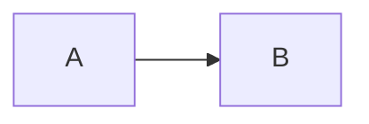

# Compendium

The Compendium is the in-app player handbook: every player and the DM use it to look up rules, terminology, and worked examples while playing. It lives at `/compendium` and is visible to DMs and players alike (see `menu_layout.md` for the access rules).

The Compendium is doc-driven. Every chapter on the page is a markdown file in `docs/common/` — no chapter content is hand-written into the Ruby side. Authors edit markdown; the app reads it; the page updates on reload. Adding a new chapter is a two-line code change plus the markdown.

The page also carries **DM-only reference pages** sourced from `docs/website_design/` (see [DM-only Website Design pages](#dm-only-website-design-pages) below). Players never see these; the DM sees them in a separate nav group.

## Page layout

The Compendium uses a two-pane layout that mirrors the Status page convention: a left-hand navigation column sized at ~180px, and a right-hand content pane that takes the rest of the width. The currently-selected nav entry is highlighted. The left nav always shows, in order:

1. **Magical Tier** — pinned as the first entry, above the Glossary. It is a registered Explainer chapter (`magical_tier`); the page lifts it to the top of the nav.
2. **Glossary** — the default landing pane (visiting `/compendium` with no `?view=` still lands here).
3. **One entry per remaining registered Explainer chapter**, in the order they're declared in `lib/explainer_docs.rb`.

The DM additionally sees a **Website Design (DM)** nav group below the player entries (see [DM-only Website Design pages](#dm-only-website-design-pages)).

Sub-views are addressed via `?view=<key>`. The global URL stays under `/compendium`; the global menu's `Compendium` link returns the viewer to the default sub-view (Glossary).

When a sub-view contains a Mermaid diagram, the Mermaid client-side renderer is loaded from a CDN. Pages without Mermaid blocks do not include the script.

## The Glossary view

The Glossary is the *union* of every glossary markdown file under `docs/common/`:

- `docs/common/common_glossary.md`
- `docs/common/dice_resolution/dice_resolution_glossary.md`
- `docs/common/check_resolution/check_resolution_glossary.md`
- `docs/common/conditions/conditions_glossary.md`

The Common Glossary is always rendered first. Per-domain glossaries follow in the order declared in `lib/glossary_docs.rb`. A glossary file with no terms (e.g. an H1 + intro paragraph only) is silently skipped — Check Resolution's currently-empty glossary file is the example.

Within a source, each `## Heading` becomes a subsection; each `**Term**: definition.` paragraph becomes a definition-list entry. Inline `code`, *italics*, and **bold** survive.

**Term ownership rule (also stated in `common_glossary.md`).** When a term is used in only one domain, it stays in that domain's glossary. When two or more domains use it, it moves to `common_glossary.md`. Definitions in the Common Glossary take precedence over any per-domain glossary; per-domain glossaries should reference common terms rather than redefine them.

## Explainer chapters

Explainer chapters are the player-facing tour through a domain — narrative paragraphs, worked examples, diagrams. They sit alongside the existing `*_design.md` and `*_tests.md` files in the same `docs/common/<domain>/` directory:

| Domain | File | Compendium nav key |
|---|---|---|
| Dice Resolution | `docs/common/dice_resolution/dice_resolution_explainer.md` | `dice` |
| Check Resolution | `docs/common/check_resolution/check_resolution_explainer.md` | `checks` |
| Conditions | `docs/common/conditions/conditions_explainer.md` | `conditions` |

The registry lives in `lib/explainer_docs.rb`. Adding a chapter means:

1. Write `docs/common/<domain>/<domain>_explainer.md`.
2. Append an entry to `ExplainerDocs::SOURCES` with a nav `key`, a display `title`, and the file `path`.

The Compendium left-nav auto-discovers the new entry and the route validates the key against the registry.

### Voice and structure

Explainers are written **for the player at the table**, not for the implementer. The reference docs (`*_design.md`) remain canonical — explainers should defer to them on conflicts. Every explainer follows the same skeleton:

1. **H1 title** matching the domain name.
2. **Lead paragraph** framing what the chapter teaches and why it matters.
3. **Reference-doc callout** as a blockquote near the top, pointing readers at the canonical design/tests files. Format:

   > **Reference docs.** Implementer-facing rules live in `*_design.md` and `*_tests.md`. This chapter is the player-facing tour. When they disagree, the design doc is canonical.

4. **H2 sections** covering the major concepts. Each section either explains a single concept or walks through a procedure end-to-end.
5. **H3 "Worked example" sub-sections** under any H2 that benefits from concrete numbers.
6. **A closing H2 section** (typically titled "What lives in the next chapter") pointing at the next domain in reading order, so the chapters chain naturally.

### Diagrams

Mermaid is the only diagram format. Author them as fenced code blocks with the `mermaid` language tag:

````markdown

````

The renderer rewrites kramdown's `<pre><code class="language-mermaid">` output into `<div class="mermaid">` so the client-side Mermaid library auto-picks them up. The Mermaid script is loaded only on chapters that actually contain a diagram.

Diagrams should illustrate either a **procedure** (a flowchart of steps in order) or a **relationship** (a graph showing how things connect). Use `flowchart LR` for pipelines; `flowchart LR` with `subgraph` blocks for relationship graphs. Keep diagrams readable in one screen-width — long node labels and dense arrow webs don't survive the 760px content column.

### Inline dice

Dice illustrations inside paragraphs use the same `.die` CSS classes as the Roll Resolution stub:

| Class | Color | Use for |
|---|---|---|
| `die fail` | red | a Failure (the lowest die value, typically 1) |
| `die neutral` | uncolored | a value below the TN |
| `die success` | green | a value at or above the TN |
| `die crit` | blue | a value at the Die Size |

Author them inline as `<span class="die success">7</span>`. Kramdown passes inline HTML through.

### Tables, lists, blockquotes

- **Tables** for structured rules (state transitions, rate tables, classification rules).
- **Bulleted lists** for parallel definitions or independent procedure items.
- **Numbered lists** for ordered procedures.
- **Blockquotes** for callouts that pull a reader's eye out of the main flow — exceptions, edge cases, cross-references. Used sparingly.

### Cross-references between chapters

Cross-reference earlier chapters by name in prose ("see Dice Resolution → Bonuses and Penalties") rather than by markdown link. The Compendium currently has no intra-page anchors, and readers always have the left nav available.

### Chapter length

There is no hard limit, but a chapter that wouldn't print on five reading-pages worth of body text probably wants to be split. The Conditions chapter is the long end of the current range; Dice Resolution and Check Resolution are the natural lengths.

## DM-only Website Design pages

Alongside the player-facing Explainer chapters, the Compendium surfaces a set of **DM-only reference pages** drawn from `docs/website_design/`. These document *how the site implements the rules* — how a stub is defined, what it relies on, and the dummy data that drives it — so the DM can inspect and fix a feature while playing. They are **not** player content.

- **Registry.** The pages are declared in `lib/design_docs.rb` (`DesignDocs::SOURCES`), keyed like the Explainer chapters: `{ key => { title:, path: } }`. The current entries are `combat` (the Combat Encounter Stub — the turn, and the blob its host builds), `action_builder` (the domain-agnostic Action Builder wizard, `public/js/ui/actionBuilder.js`), `combat_interfaces` (the required interfaces), and `combat_test_data` (a worked example of the Action Builder blob).
- **Nav.** For the DM, `views/compendium.erb` renders these below the player entries under a **Website Design (DM)** group heading (`.compendium-nav-group`). Players never see the group.
- **Access.** Visibility is the standard DM check — `dm_view?` (loopback request and not viewing-as-player). `lib/routes/compendium.rb` only admits a `DesignDocs` `?view=` key when `dm_view?` is true; a player (or the DM viewing as a player) who requests one is bounced to the default Glossary, matching the "treated as if the page did not exist" rule in `menu_layout.md`.

### Hidden developer directives

Because these pages are DM-only, they may carry **developer directives and notes that are stripped from the rendered page but kept in the source file** (`DesignDocs.strip_directives`):

| Source markup | Meaning | Rendered as |
|---|---|---|
| `@function <name>` (line) | A developer declaration. | Removed. |
| ` ```test … ``` ` (fence) | A worked sample data blob / test cases. | Removed. |

Everything else renders as ordinary Markdown (kramdown + GFM), with the same `mermaid` fence rewrite as the Explainer chapters (`DesignDocs` reuses `ExplainerDocs.rewrite_mermaid_blocks`). Cross-references between the DM pages use in-app `/compendium?view=<key>` links so the DM can hop between a stub and its interfaces.

## Authoring checklist

Before merging a new or edited chapter:

1. The H1 matches the registered title and the domain name.
2. The reference-doc blockquote points at real files.
3. Every term used appears either in `common_glossary.md` or in the matching `<domain>_glossary.md` — or, if introduced in the chapter, is defined inline at first use.
4. Any Mermaid block renders in a browser (the CDN handles syntax errors silently — broken diagrams just don't appear).
5. Worked examples agree numerically with the rules section above them.
6. The closing "What lives in the next chapter" section names the next domain in reading order.
